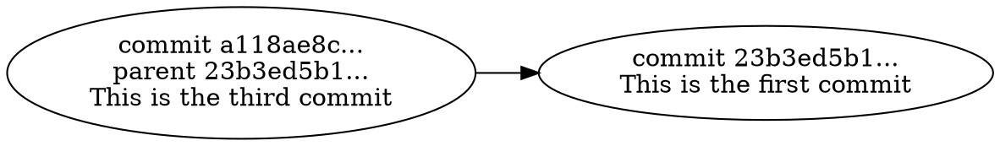

<!-- Lecture material made by Mirko Myllykoski for the version of the course that was given in fall 2020. Lecture was first given by Mirko Myllykoski in fall 2020. Various small changes done by Birgitte Brydsö for the fall 2023 and fall 2024 versions of the course.-->

<!-- Slides: https://hackmd.io/@git-fall-2024/L3-concepts -->

# Lecture 3: Basic concepts 

---

## Remark

- You are **not** intended to memorize any commands or low-level details. 
- The goal is to learn the *basic concepts*: 
    - hash sums, blobs, trees, commits, references, branches, ...
- Understanding these concepts helps to understand what the commands actually do!

---

## What is Git?

- Git is a **distributed** VCS: 
    - Does not rely on a server-client model.
    - Instead, everyone has a full copy of the entire project (repository).
        - Complete history, metadata, etc.
    - People can work completely independently. 
    - An (optional) server is used only to distribute changes. 

---

### Why use Git?

- It is popular.
    - Many project already use it, people know how to use it, people can tell you how to use it, ...
- Relies on hash sums: 
    - Built-in data corruption detection.
    - Built-in security.
- Distributed.
- Fast, simple and flexible.
- Free and open-source.

---

## How does Git store the history?

---

### What is inside a repository?

```shell
$ mkdir repository && cd repository
$ git init
Initialized empty Git repository in .../repository/.git/
$ find
```


---

Most directories are empty and the files are not that interesting:

```shell
$ cat .git/config 
[core]
        repositoryformatversion = 0
        filemode = true
        bare = false
        logallrefupdates = true
$ cat .git/HEAD 
ref: refs/heads/master
$ cat .git/description 
Unnamed repository; edit this file 'description' to name the
repository.
```

---

Let's add some content:

```shell
$ echo "This file is very interesting" > file.txt
$ git add file.txt
$ git commit -m "This is the first commit"
[master (root-commit) 23b3ed5] This is the first commit
 1 file changed, 1 insertion(+)
 create mode 100644 file.txt
$ find
```


---

### Working tree

- Everything inside `repository/` is a part of the *working tree* (or the *workspace*).
    - `.git/` is not included.
    - At the moment, the working tree contains just one file, `file.txt`.
    - Working tree is just a regular directory.
- The `git add` and `git commit` commands tell Git to care about `file.txt`.
    - More on that later...

---

### Objects

- Git stores files etc as **objects**:
    - Objects are stored under `.git/objects/`.
- Git uses *content-based addressing*.
    - A *hash sum* is computed from the **content** of the object.
    - The hash "uniquely" identifies the object.
    - Two objects with identical contents have the same hash and are stored only once.

---

- We can compute the hash manually:

```shell
$ git hash-object file.txt
09c78e6e971ce9e3d69e75bcb3ffd5de05b0d59a
```

- We can find the corresponding object:

```shell
$ find
...
./.git/objects/09/c78e6e971ce9e3d69e75bcb3ffd5de05b0d59a
...
```

- We can confirm that two files with identical contents have the same hash:

```shell
$ cp file.txt file2.txt 
$ git hash-object file.txt file2.txt
09c78e6e971ce9e3d69e75bcb3ffd5de05b0d59a
09c78e6e971ce9e3d69e75bcb3ffd5de05b0d59a
```

---

- Note that we do not have to use the entire hash:

```shell
git cat-file -p 09c78e6e
This file is very interesting
```

- We only need to use as many characters as is required to uniquely identify the object.
    - 7-8 is enough in most cases.
    - 12 in larger projects.
- If more characters is required, an error message is printed.

---

- Objects cannot (and should not) be accessed directly:

```shell
$ hexdump -C ./.git/objects/09/c78e6e97*
00000000  78 01 4b ca c9 4f 52 30  ....  |x.K..OR06`...,VH|
00000010  cb cc 49 55 00 d2 65 a9  ....  |..IU..e.E...y%.E|
00000020  a9 c5 25 99 79 e9 5c 00  ....  |..%.y.\..I.3|
0000002c
```

- However, we can observe the type and the content of an object:

```shell
$ git cat-file -t 09c78e6e
blob
$ git cat-file -p 09c78e6e
This file is very interesting
```

---

- It is also important to realize that the object stays even when the file is removed:

```shell
$ rm file.txt
$ find
....
./.git/objects/09/c78e6e971ce9e3d69e75bcb3ffd5de05b0d59a
....
$ git cat-file -p 09c78e6e971ce9e3d69e75bcb3ffd5de05b0d59a
This file is very interesting
```

- We can restore the file from the object:

```shell
$ git restore file.txt
$ cat file.txt 
This file is very interesting
```

---

Let's take a second look at the repository:


*What are these two other objects?*

---

### Trees

- Let's investigate one of the remaining objects:

```shell
$ git cat-file -t 1a098a06
tree
$ git cat-file -p 1a098a06
100644 blob 09c78e6e971ce9e3d69e75b....    file.txt
```

- We can see that the type of the object is **tree**:
    - A tree stores pointers to
        - files (blobs) and 
        - other trees,
    - Trees are used to represent directory structures.

---

In this case, the tree has one level and one blob:


---

Let's take a third look at the repository:


*Just one object remains...*

---

### Commits

- Let's investigate the last object:

```shell
$ git cat-file -t 23b3ed5b
commit
$ git cat-file -p 23b3ed5b
tree 1a098a06bf0bcae9695238d9d5cb96345c00cacf
author Mirko Myllykoski <....@gmail.com> 1600867851 +0200
committer Mirko Myllykoski <....@gmail.com> 1600867851 +0200

This is the first commit
```

- The type of the object is **commit**. It contains 
    - a pointer to a tree, 
    - an author and a committer (+time), and 
    - a commit message 

---

A commit stores the state of the project in a given point of time.

---

In this case, the commit points to a tree that has one level and one blob:


---

In a more general case, the associated tree can contain **several** levels and **multiple** blobs:


---

## Working with Git

---

Let's see what else we can find...


---

### HEAD and other references

- `HEAD` points (indirectly) to `23b3ed5b1`:

```shell
$ cat ./.git/HEAD
ref: refs/heads/master
$ cat .git/refs/heads/master
23b3ed5b16095bb84b18d06734fdd614c8982841
```


---

- `HEAD` and `master` are **references**.
    - A reference points to commits and another reference.
- `HEAD` determines "most recent" commit.
    - Many commands **act on the current `HEAD`**. 
    - More on this later
- `master` is the current branch (more later). 

---

- You can create a reference yourself: 

```shell
$ git tag first
$ find
```


```shell
$ git rev-parse first
23b3ed5b16095bb84b18d06734fdd614c8982841
```


---

### Index (staging area)

Let's repeat some of the earlier steps:

```shell
$ echo "More content" >> file.txt
$ git add file.txt
$ find
```


```shell
$ git cat-file -p 3b23ff0c
This file is very interesting
More content
```

---

- The `git add` command creates a blob that correspond to the update `file.txt` file.
    - No other object are created yet.
- The command also adds the file to the **index**.
- The index will become the **next commit**.
    - Contains a representation of the tree object.

---

The index is a binary file:


---

We can now turn the index to the next commit:

```shell
$ git commit -m "This is the second commit"
[master d3c6c63] This is the second commit
 1 file changed, 1 insertion(+)
$ find
```


---

 - Just as before, we have a tree object that describes the directory structure:

```shell
$ git cat-file -p 22b5208b
100644 blob 3b23ff0c411faf22c9253ed0....    file.txt
```

- And a commit, that describes the state of the repository:

```shell
$ git cat-file -p d3c6c635
tree 22b5208bebacfcf745691f799b08df492b2a7da9
parent 23b3ed5b16095bb84b18d06734fdd614c8982841
author Mirko Myllykoski <mirko...> 1601228824 +0200
committer Mirko Myllykoski <mirko....> 1601228824 +0200

This is the second commit
```

---

### Parent

- The major difference is that the commit contains a pointer to a **parent**:

```
parent 23b3ed5b16095bb84b18d06734fdd614c8982841
```

- The parent pointer points to the previous commit: 


---

### Commit tree

- Usually, we have a complete tree of commits (**commit tree**):


- Each commit represents the state of the repository at a given point of time.

---

- Each commit is allowed to have **multiple** parents:


- These parents appear when two (or more) *branches* are **merged**.
    - More on this later...

---

### HEAD and other references (again)

- Let's investigate `HEAD` and `master`:

```shell
$ cat .git/HEAD 
ref: refs/heads/master
$ cat .git/refs/heads/master
d3c6c635fb44c7084797d47050bff7961853c19b
```


- Remember, many Git commands act on the current `HEAD`.

---

- We can change the `HEAD` to something else:

```shell
$ git checkout 23b3ed5b
....
HEAD is now at 23b3ed5 This is the first commit
$ cat .git/HEAD 
23b3ed5b16095bb84b18d06734fdd614c8982841
$ cat file.txt 
This file is very interesting
```


---

### Branches

- We can modify the working tree and create a new commit:

```shell
$ echo "Different content" >> file.txt 
$ git commit -a -m "This is the third commit"
[detached HEAD a118ae8] This is the third commit
 1 file changed, 1 insertion(+)
```

- Let's investigate the newly created commit:

```shell
$ git cat-file -p a118ae8c
tree 5fcc4f83fedf5a94cd773704bdb1ab2cdcadc6fd
parent 23b3ed5b16095bb84b18d06734fdd614c8982841
author Mirko Myllykoski <mirko....> 1601286412 +0200
committer Mirko Myllykoski <mirko....> 1601286412 +0200

This is the third commit
```

---

- First, the `parent` points to the **first commit**:



---

<!-- .slide: style="font-size: 24px;" -->

 - Second, the commit tree now has **two** branches: 

```graphviz
digraph {
  rankdir=LR
  nodesep=0.2
  
  "HEAD" [fontsize=10 shape=plaintext]
  "master" [fontsize=10 shape=plaintext]
  
  third_commit [fontsize=10 label="commit a118ae8c...\nThis is the third commit"]
  second_commit [fontsize=10 label="commit d3c6c635...\nThis is the second commit"]
  first_commit [fontsize=10 label="commit 23b3ed5b1...\nThis is the first commit"]
  
  third_blob [fontsize=10 label="blob ea5f4b8e\nThis file is very interesting\nDifferent content" shape=box]
  second_blob [fontsize=10 label="blob 3b23ff0c\nThis file is very interesting\nMore content" shape=box]
  first_blob [fontsize=10 label="blob 09c78e6e...\nThis file is very interesting" shape=box]
  
  third_commit -> third_blob [style=dashed]
  second_commit -> second_blob [style=dashed]
  first_commit -> first_blob [style=dashed]
  
  third_commit -> first_commit
  second_commit -> first_commit
  
  "HEAD" -> third_commit 
  "master" -> second_commit
  
  subgraph cluster_working_tree {
    nodesep=0.2
    fontsize=10
    label="Working tree"
    subgraph cluster_file {
      fontsize=10
      label="file.txt"
        "This file is very interesting\nDifferent content
" [fontsize=10 shape=plain]
    }
  }
}
```

---

<!-- .slide: style="font-size: 24px;" -->

We can give the second branch a **name**:

```shell
$ git checkout -b second_branch
Switched to a new branch 'second_branch'
$ cat .git/HEAD 
ref: refs/heads/second_branch
$ cat .git/refs/heads/second_branch
a118ae8cda10a8f0a966ab7b9158b4a6d3b48cfc
```

```graphviz
digraph {
  rankdir=LR
  nodesep=0.2
  
  "HEAD" [fontsize=10 shape=plaintext]
  "master" [fontsize=10 shape=plaintext]
  "second_branch" [fontsize=10 shape=plaintext]
  
  third_commit [fontsize=10 label="commit a118ae8c...\nThis is the third commit"]
  second_commit [fontsize=10 label="commit d3c6c635...\nThis is the second commit"]
  first_commit [fontsize=10 label="commit 23b3ed5b1...\nThis is the first commit"]
  
  third_blob [fontsize=10 label="blob ea5f4b8e\nThis file is very interesting\nDifferent content" shape=box]
  second_blob [fontsize=10 label="blob 3b23ff0c\nThis file is very interesting\nMore content" shape=box]
  first_blob [fontsize=10 label="blob 09c78e6e...\nThis file is very interesting" shape=box]
  
  third_commit -> third_blob [style=dashed]
  second_commit -> second_blob [style=dashed]
  first_commit -> first_blob [style=dashed]
  
  third_commit -> first_commit
  second_commit -> first_commit
  
  "HEAD" -> third_commit
  "master" -> second_commit
  "second_branch" -> third_commit
  
  subgraph cluster_working_tree {
    fontsize=10
    label="Working tree"
    subgraph cluster_file {
      fontsize=10
      label="file.txt"
        "This file is very interesting\nDifferent content
" [fontsize=10 shape=plain]
    }
  }
}
```

---

### Merging

We can **merge** the two branches together:

```shell
$ git checkout master
$ git merge --no-ff second_branch
Auto-merging file.txt
CONFLICT (content): Merge conflict in file.txt
Automatic merge failed; fix conflicts and then commit the
result.
$ vim file.txt
```

We fix some **conflicts** at this point...

```shell
$ git add file.txt
$ git merge --continue
[master f0d7298] Merge branch 'second_branch'
```

---

The created commit has **two** parents:

```shell
$ git cat-file -p f0d72989
tree f63f3a4c548f5065cee598bed4ae189bd2c099d8
parent d3c6c635fb44c7084797d47050bff7961853c19b
parent a118ae8cda10a8f0a966ab7b9158b4a6d3b48cfc
author Mirko Myllykoski <mirko....> 1601288485 +0200
committer Mirko Myllykoski <mirko....> 1601288485 +0200

Merge branch 'second_branch'
```

---

<!-- .slide: style="font-size: 26px; text-align: left;" -->

Finally, the tree looks like follows:

```graphviz
digraph {
rankdir=LR
nodesep=0.03
    subgraph cluster_working_tree {
        label="Working tree"
        nodesep=0.1
        fontsize=9 width=0.03 height=0.02
        subgraph cluster_file {
           fontsize=9 width=0.03 height=0.02
           label="file.txt"
        "This file is very interesting\nMore content\nDifferent content" [fontsize=9 width=0.03 height=0.02 shape=plain]
    }
  }
  }
  ```

```graphviz
digraph {
  rankdir=LR
  nodesep=0.03
  
  "HEAD" [fontsize=8 width=0.03 height=0.02 shape=plaintext]
  "master" [fontsize=8 width=0.03 height=0.02 shape=plaintext]
  "second_branch" [fontsize=8 width=0.03 height=0.02 shape=plaintext]
  
  fourth_commit [fontsize=8 width=0.03 height=0.02 label="commit f0d72989...\nMerge branch 'second_branch'"]
  third_commit [fontsize=8 width=0.03 height=0.02 label="commit a118ae8c...\nThis is the third commit"]
  second_commit [fontsize=8 width=0.03 height=0.02 label="commit d3c6c635...\nThis is the second commit"]
  first_commit [fontsize=8 width=0.03 height=0.02 label="commit 23b3ed5b1...\nThis is the first commit"]
  
  fourth_blob [fontsize=8 width=0.03 height=0.02 label="blob e51364b9\nThis file is very interesting\nMore content\nDifferent content" shape=box]
  third_blob [fontsize=8 width=0.03 height=0.02 label="blob ea5f4b8e\nThis file is very interesting\nDifferent content" shape=box]
  second_blob [fontsize=8 width=0.03 height=0.02 label="blob 3b23ff0c\nThis file is very interesting\nMore content" shape=box]
  first_blob [fontsize=8 width=0.03 height=0.02 label="blob 09c78e6e...\nThis file is very interesting" shape=box]
  
  fourth_commit -> fourth_blob [fontsize=8 width=0.03 height=0.02 style=dashed]
  third_commit -> third_blob [fontsize=8 width=0.03 height=0.02 style=dashed]
  second_commit -> second_blob [fontsize=8 width=0.03 height=0.02 style=dashed]
  first_commit -> first_blob [fontsize=8 width=0.03 height=0.02 style=dashed]
  
  fourth_commit -> second_commit
  fourth_commit -> third_commit
  third_commit -> first_commit
  second_commit -> first_commit
  
  "HEAD" -> fourth_commit
  "master" -> fourth_commit
  "second_branch" -> third_commit
  
}
```

---

<!-- .slide: style="font-size: 24px; text-align: left;" -->

### Switching to a specific commit

We can always move back to any of the previous commits:

```shell
$ git checkout 23b3ed5b1
....
HEAD is now at 23b3ed5 This is the first commit
$ cat file.txt 
This file is very interesting
```

```graphviz
digraph {
rankdir=LR
nodesep=0.03
    subgraph cluster_working_tree {
    label="Working tree"
    fontsize=8 width=0.03 height=0.02 
    subgraph cluster_file {
      label="file.txt"
      fontsize=8 width=0.03 height=0.02 
        "This file is very interesting" [fontsize=8 width=0.03 height=0.02 shape=plain]
    }
  }
  }
```

```graphviz
digraph {
  rankdir=LR
  nodesep=0.2
  
  "HEAD" [fontsize=8 width=0.03 height=0.02 shape=plaintext]
  "master" [fontsize=8 width=0.03 height=0.02 shape=plaintext]
  "second_branch" [fontsize=8 width=0.03 height=0.02 shape=plaintext]
  
  fourth_commit [fontsize=8 width=0.03 height=0.02 label="commit f0d72989...\nMerge branch 'second_branch'"]
  third_commit [fontsize=8 width=0.03 height=0.02 label="commit a118ae8c...\nThis is the third commit"]
  second_commit [fontsize=8 width=0.03 height=0.02 label="commit d3c6c635...\nThis is the second commit"]
  first_commit [fontsize=8 width=0.03 height=0.02 label="commit 23b3ed5b1...\nThis is the first commit"]
  
  fourth_blob [fontsize=8 width=0.03 height=0.02 label="blob e51364b9\nThis file is very interesting\nMore content\nDifferent content" shape=box]
  third_blob [fontsize=8 width=0.03 height=0.02 label="blob ea5f4b8e\nThis file is very interesting\nDifferent content" shape=box]
  second_blob [fontsize=8 width=0.03 height=0.02 label="blob 3b23ff0c\nThis file is very interesting\nMore content" shape=box]
  first_blob [fontsize=8 width=0.03 height=0.02 label="blob 09c78e6e...\nThis file is very interesting" shape=box]
  
  fourth_commit -> fourth_blob [style=dashed]
  third_commit -> third_blob [style=dashed]
  second_commit -> second_blob [style=dashed]
  first_commit -> first_blob [style=dashed]
  
  fourth_commit -> second_commit
  fourth_commit -> third_commit
  third_commit -> first_commit
  second_commit -> first_commit
  
  "HEAD" -> first_commit
  "master" -> fourth_commit
  "second_branch" -> third_commit
  
}
```

---

The end.

An idea: Try to play with the different commands. See what happens to the `.git/` directory.

