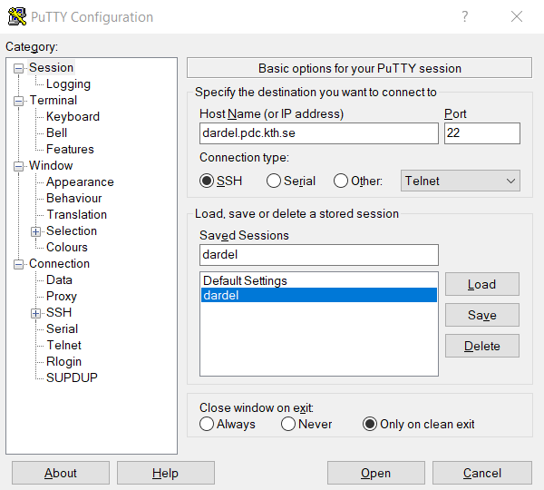
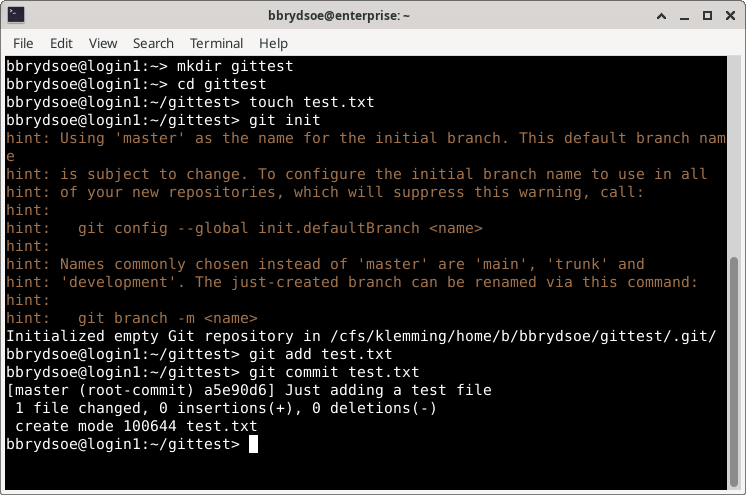

<!-- Lecture material made by Birgitte Brydsö for the version of the course that was given in fall 2020. Lecture was first given by Birgitte Brydsö in fall 2020. 
Minor modifications done for the fall 2021 and 2022 versions of the course. For the 2023 version of the course the machine was changed from Kebnekaise to Rackham. In 2024, Rackham will also be used. 
For the 2024 version of the course, the machine was changed from Rackham to Tetralith, though the material for using Triolith remains, as Lecture B. -->
<!-- For the 2025 version of the course, a page was made for using Dardel. -->

<!-- Slides: https://hackmd.io/@git-fall-2024/tetralith#/ --> 

---

# Connecting to Dardel

For this course we recommend using ThinLinc, but if you have your own installation of another SSH client that you prefer, you are welcome to use that. We will be using the command line only, so an SSH client like PuTTY would also work, as would connecting from a Linux/macOS terminal with SSH. 

## Setup, Dardel

In order to use Dardel, you need to first setup SSH keys (or kerberos - see here if you prefer that: <a href="https://support.pdc.kth.se/doc/login/kerberos_login/" target="_blank">https://support.pdc.kth.se/doc/login/kerberos_login/</a>). 

Here we will cover how to set up SSH keys for Dardel. 

!!! note "Create an SSH key pair" 

    ===  "Linux"

        1. Open a terminal.
        2. Create an `.ssh` directory for the key pair if you do not have one. It should be in your home directory: `mkdir $HOME/.ssh`
        3. Make sure the new directory has the right access permissions: `chmod 700 $HOME/.ssh`
        4. Generate the SSH key pair by typing this in the terminal: 
           ```bash
           ssh-keygen -t ed25519 -f ~/.ssh/id-ed25519-pdc
           ```
        5. You should set a password when asked for it. Note that you will have to enter this every time you use it, unless you load it in an agent. If you do not want to use a passphrase, just press "Enter" when asked for the passphrase.
        6. An SSH key pair will be generated and placed in the `.ssh` directory.

    === "macOS"

        1. Open a Terminal window. Do one of: 
            - Open Finder, select "Applications" -> "the Utilities folder". Double-click "Terminal" within there. 
            - Open "Launchpad". Search for "Terminal" and double click on the "Terminal" application.
        2. Create an `.ssh` directory for the key pair if you do not have one. It should be in your home directory: `cd` and `mkdir .ssh`
        3. Make sure the new directory has the right access permissions: `chmod 700 .ssh`
        4. Generate the SSH key pair by typing this in the terminal: 
           ```bash
           ssh-keygen -t ed25519 -f ~/.ssh/id-ed25519-pdc
           ```
        5. You should set a password when asked for it. Note that you will have to enter this every time you use it, unless you load it in an agent. If you do not want to use a passphrase, just press "Enter" when asked for the passphrase. 
        6. An SSH key pair will be generated and placed in the `.ssh` directory. 

    === "Windows"

        - Please follow these instructions: <a href="https://support.pdc.kth.se/doc/login/windows_login/#install-and-configure-kerberos-and-ssh-for-windows" target="_blank">https://support.pdc.kth.se/doc/login/windows_login/#install-and-configure-kerberos-and-ssh-for-windows</a>

!!! note "PDC authentication portal & adding a new key"

    - Once you have successfully produced a working SSH key pair, use your browser to open the PDC login portal: <a href="https://loginportal.pdc.kth.se/" target="_blank">https://loginportal.pdc.kth.se/</a>. 
    - You will see a start page with a link to the Swedish User and Project Repository (SUPR). Click on the SUPR link. 
    - Login to SUPR if you are not already logged in. 
        - NOTE: SUPR does not use the same password as the one you received from PDC. If you have not previously set up a SUPR password, you can log in with SWAMID. If you are using TOTP, do so as well. 
    - Click on the blue "Prove My Identity to PDC" button. 
    - You should now be back in the PDC login portal. Your personal information should be displayed. 
    - Now pick "Add new key" 
    - Upload or copy and paste the **public** part of your SSH key pair (usually with extension .pub). 
        - If you do not see the `.ssh` directory try toggling the visibility of hidden/dot files with e.g. pressing `Ctrl + h` in Linux or `shift + cmd + ‘.’` for MacOS.
        - It is a good idea to pick a label ("Key name") so you can easier remember where the key is for. 
        - The IP address from where you are connected as seen from the portal will already be shown in the address field as a default. A significant bit mask of between /24 and /32 or a domain-name based range can be added to the IP address.
        - For "Expires" (expiration date), the maximum allowed value is shown. You can change it if you want to.  
        - Press "Save". 
        - You will be back on the page with the personal info. You can add more IP addresses where you may connect from. 
        - You are now ready to use the SSH keys to login to Dardel! 

## Logging in 

### ThinLinc

* Download the ThinLinc client from <a href="https://www.cendio.com/thinlinc/download" target="_blank">https://www.cendio.com/thinlinc/download</a>  and install it if you are going to use that.

## Logging in 

* Start the client. Enter the name of the server: ``dardel-vnc.pdc.kth.se`` and then enter your own PDC username.
* Go to "Options" -> "Security". Check that authentication method is set to "Public key". It should suggest the correct key, but if it does not, browse for it. Remember to check "Show hidden files" so you can find the `.ssh` directory. Pick your public key. 
* Go to "Options" -> "Screen" and uncheck "Full screen mode".
* Click "Connect". Enter your SSH key pair password for PDC if you set one. 


### Regular SSH client

!!! hint "Logging in to Dardel with SSH keys" 

    - In an SSH terminal (Linux, macOS), type: `ssh -i ~/.ssh/id-ed25519-pdc <Your-PDC-username>@dardel.pdc.kth.se`
        - You may also try ``ssh dardel.pdc.kth.se`` or ``ssh <username>@dardel.pdc.kth.se`` depending on whether you have the same username or not as at PDC. 
    - In windows, depending on the SSH client, pick SSH key pair as authentication method. Then login with `dardel.pdc.kth.se` as Host name. For PuTTY it may look like this: 
         
    - Whether Windows, Linux, or macOS, you will likely get a qiestions about the server's host key not being in the registry. Just pick "Accept". 

- Information about connecting, SSH key pairs, and setting up access at PDC: 
    - <a href="https://support.pdc.kth.se/doc/basics/quickstart/" target="_blank">https://support.pdc.kth.se/doc/basics/quickstart/</a>
    - <a href="https://support.pdc.kth.se/doc/login/ssh_login/" target="_blank">https://support.pdc.kth.se/doc/login/ssh_login/</a>
    - <a href="https://support.pdc.kth.se/doc/login/ssh_keys/" target="_blank">https://support.pdc.kth.se/doc/login/ssh_keys/</a>
    - <a href="https://support.pdc.kth.se/doc/login/windows_login/#install-and-configure-kerberos-and-ssh-for-windows" target="_blank">https://support.pdc.kth.se/doc/login/windows_login/#install-and-configure-kerberos-and-ssh-for-windows</a>
    - <a href="https://support.pdc.kth.se/doc/login/interactive_hpc/" target="_blank">https://support.pdc.kth.se/doc/login/interactive_hpc/</a>     

---

## Setting up Git

Git is already installed on Dardel, but you need to set your name and email globals *unless you have already done this at some earlier time*. 

!!! warning

    In the below, do not copy the first `$` as it is a representation of the prompt. 


* Open a terminal. In ThinLinc: Go to the menu at the top. Click “Applications” → “System Tools” → “Terminal”.
* Set your global name (change "Your Name"): 
  `$ git config --global user.name "Your Name"`
* Set your global email (change the example): 
  `$ git config --global user.email "name@example.com"` 

You may also want to set your editor. We recommend nano, but other options are vim and emacs (or notepad if you are on a Windows system). 

* `$ git config --global core.editor nano`

This is how it looked for me, when loggen in on the Dardel login node (I also tested the version of Git): 

```bash
bbrydsoe@login1:~> git --version
git version 2.35.3
bbrydsoe@login1:~> git config --global user.name "Birgitte Brydsö"
bbrydsoe@login1:~> git config --global user.email "bbrydsoe@hpc2n.umu.se"
bbrydsoe@login1:~> git config --global core.editor nano
```

---

## Testing your configuration 

Create an example folder and cd into that, then create a file test.txt: 

```bash
$ mkdir <mydir> 
$ cd <mydir>
$ touch test.txt
```

Now initialize a repository and add the new file:

```bash
$ git init
$ git add test.txt
```

Now *commit* the change. The editor which you configured earlier should open. Add an example commit message:

```bash
$ git commit test.txt 
```

This looked like this for me: 



---

Now let us look at the log:

```bash
$ git log
```

When you do `git log`, you should see something like: 

```bash
commit a5e90d6237ba4a240bd31e9b9fb3dfa7e4c35ed3 (HEAD -> master)
Author: Birgitte Brydsö <bbrydsoe@hpc2n.umu.se>
Date:   Mon Oct 27 14:39:31 2025 +0100

    Just adding a test file
```

but with name, email and commit message different.

If that is the case, your Git should be configured correctly. 

---

## Download the course materials

For the individual hands-on part of the course, we have created some course materials which you will download from either the course website, the course GitHub, or the "important information" page. 

* Course website: <a href="https://www.hpc2n.umu.se/events/courses/2025/git" target="_blank">https://www.hpc2n.umu.se/events/courses/2025/git</a> 
* Course GitHub: https://github.com/hpc2n/course-intro-git
    - Click the green button labeled "Code" for links to clone or download the materials. 
    - Either do **1. CLONE** or **2. DOWNLOAD**, not both! 
        - CLONE: Change to the directory where you wish to have the course material and clone with 'git clone' and the url: 
            - ``git clone https://github.com/hpc2n/course-intro-git.git``
            - You get the directory: `course-intro-git`
        - DOWNLOAD Zipfile: Please go to the terminal window where you have downloaded and set up Git. Change the directory to wherever you wish to have the course material. 
            - Download the Zipfile and move it there. Can be done directly from the terminal with `wget https://github.com/hpc2n/course-intro-git/archive/refs/heads/main.zip`)
            - Unpack with `unzip main.zip`. 
            - You will get a directory called `course-intro-git-main`. 

---

## GitHub and SSH keys

* You need to create an account on GitHub for the course
* You also need to create SSH keys on Dardel and install these on GitHub (in addition to the ones you created on your own machine in order to connect to Dardel) 
* We will go through this in a general way which should work regardless of system you are using
    * We will go through it before the Teamwork session. The material for creating and setting up SSH keys are here: <a href="https://hpc2n.github.io/course-intro-git/setup/#create__a__new__ssh__key__for__github" target="_blank">https://hpc2n.github.io/course-intro-git/setup/#create__a__new__ssh__key__for__github</a>


