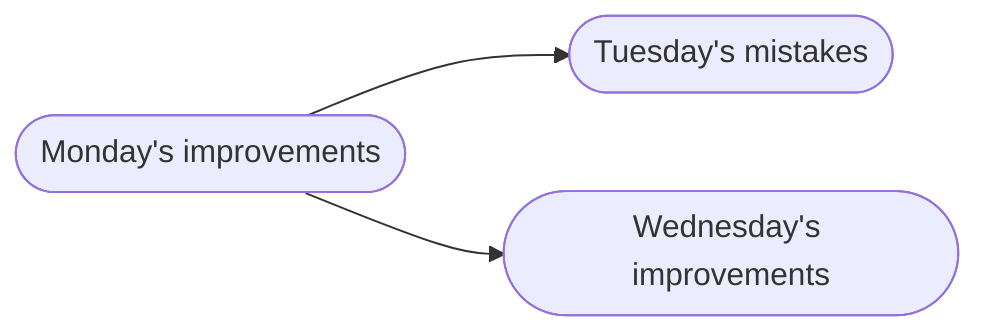
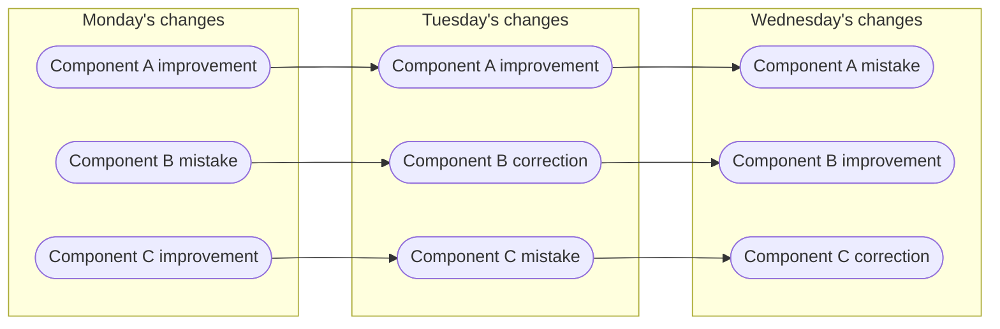

<!-- Lecture material made by Mirko Myllykoski for the version of the course that was given in fall 2020. The lecture was first given by Mirko Myllykoski in fall 2020.
Very minor modifications have been made by Birgitte Brydsö for the fall 2021, fall 2022, fall 2023, and fall 2024 versions of the course. Moved to GitHub and some tweaks (mainly to graphs) done by Birgitte Brydsö to get it to work on GitHub pages for the 2025 version of the course. -->

<!-- Slides: https://hackmd.io/@git-fall-2024/L1-motivation/ --> 

---

# Lecture 1: Motivation

---

## What is version control?

---

In software engineering, version control (also known as revision control, source control, or source code management) is a class of systems responsible for __managing changes__ to computer programs, documents, large web sites, or other collections of information.
--- Wikipedia

---

## Version control systems (VCS)

... systems responsible for **managing changes** ...

---

## Why use version control?

---

In an ideal world, things develop linearly: 

- Every new version is an improvement upon the previous version. 
    - No need to backtrack. 
- Everyone knows what everyone else is doing 
- In the end, things are simply finished. 

---

In the real world, things develop non-linearly: 

- A new version can be anything between 
    - a complete catastrophe and 
    - a major breakthrough.
- People do not know what others are doing 
- Sometimes we are simply fixing earlier mistakes... 

---

### Going back to an earlier version

Sometimes, it is easier to simply backtrack to an *earlier version*...

---

#### Where is this *earlier version*?

 - CTRL + Z <!-- .element: class="fragment" -->
 - my_file.txt, my_file.txt.old, ... <!-- .element: class="fragment" -->
 - My project/ <!-- .element: class="fragment" -->
     - 2020-08-12/
     - 2020-08-13/
     - ...
 - Daily home directory backup <!-- .element: class="fragment" -->

---

#### Challenges and obstacles

 - Prone to mistakes <!-- .element: class="fragment" -->
     - CTRL + Z has limits, overwritten/deleted files, human/hardware error <!-- .element: class="fragment" -->
 - How much to save? <!-- .element: class="fragment" -->
     - Individual files? Everything? How much space is required? <!-- .element: class="fragment" -->
 - How to organize versions? <!-- .element: class="fragment" -->
     - What is the difference between different versions? <!-- .element: class="fragment" -->

*Overall, difficult to manage!* <!-- .element: class="fragment" -->

---

#### What about the granularity?

*This compounds the problems!*

---

#### How does VCS solve this?

 - Stores the history using snapshots (commits) <!-- .element: class="fragment" -->
     - Each snapshot represents the project at a given point in time <!-- .element: class="fragment" -->
 - Manages snapshots and associated metadata <!-- .element: class="fragment" -->
     - Naming (tags), comments, dates, authors, etc <!-- .element: class="fragment" -->
 - Easy to move between different snapshots <!-- .element: class="fragment" -->
 - Can handle different degrees of granularity <!-- .element: class="fragment" -->
 - Can handle multiple development paths (branches) <!-- .element: class="fragment" -->

---

### Comparing and joining

 - VCS makes it easy to compare different snapshots <!-- .element: class="fragment" -->
     - Named revisions, comments, time information, author information <!-- .element: class="fragment" -->
     - Diff tools <!-- .element: class="fragment" -->
     - Search tools <!-- .element: class="fragment" -->
     - Bisection search <!-- .element: class="fragment" -->
 - VCS also allows the joining (merging) of different snapshots  <!-- .element: class="fragment" -->
     - Easy to experiment with ideas <!-- .element: class="fragment" -->

---

### Collaboration

 - One of the primary functions of VCS is to allow collaboration <!-- .element: class="fragment" -->
 - Usual setup: server (remote) + multiple clients <!-- .element: class="fragment" -->
     - People work locally and send (push) the changes to the server <!-- .element: class="fragment" -->
     - VCS keeps track of what has been done and by whom <!-- .element: class="fragment" -->
 - Safer since mistakes can be easily remedied <!-- .element: class="fragment" -->
 - The contributions of several people can be merged <!-- .element: class="fragment" -->

---

### Backup

 - VCS functions as a backup <!-- .element: class="fragment" -->
 - Locally, the system maintains a copy of each file <!-- .element: class="fragment" -->
     - Usually only the changes or the files that have changed are stored <!-- .element: class="fragment" -->
 - Globally, lost files can be recovered from the server <!-- .element: class="fragment" -->

---

### Integration

 - VCSs such as Git have been integrated with several services <!-- .element: class="fragment" -->
     - HackMD, Overleaf, ...
 - Services such as GitHub can do almost everything for you <!-- .element: class="fragment" -->
     - Store history, distribute, testing / continuous integration, bug reports, milestones, website, ... <!-- .element: class="fragment" -->

---

### Summing up

Version control systems

- keeps track of your files and other output
- tracks what is created and modified
- tracks who made the modifications
- tracks why the modifications were made (if you make good commit comments)

---

## Practical use cases

What are the practical use cases for VCS?

---

### Source code

 - Many VCSs are designed for managing source code <!-- .element: class="fragment" -->
 - Manage deployment (production, development, testing, etc) <!-- .element: class="fragment" -->
 - Manage published versions (v0.1 etc) <!-- .element: class="fragment" -->
 - Manage (experimental) features <!-- .element: class="fragment" -->
 - Bug hunting <!-- .element: class="fragment" -->
 - But also for: writers, artists, composers... <!-- .element: class="fragment" -->

---

### Latex files

 - Track which version of a manuscript has been <!-- .element: class="fragment" -->
     - submitted, 
     - revised and/or 
     - accepted
 - Collaboration between several authors <!-- .element: class="fragment" -->

---

### HPC: batch files and data

 - Track different versions of your batch scripts <!-- .element: class="fragment" -->
     - Easy to check the used configuration afterwards
 - Track input and output files <!-- .element: class="fragment" -->
     - Limited to smallish files

---

### Examples of VCS

<!-- .slide: style="font-size: 24px;" -->

- SCCS: The first VCS. Created in 1972 at Bell Labs. Was available only for UNIX and worked with Source Code files only.
- RCS (Revision Control System): First release July 1985. Usually superseded by other systems such as CVS, which began as a wrapper on top of RCS. 
- CVS (centralized version control system): First release July 1986; based on RCS. Expands on RCS by adding support for repository-level change tracking, and a client-server model. 
- Apache Subversion (SVN): First release in 2004 by CVS developers with the goal of replacing CVS. 
- BitKeeper: Initial release May 2000. Distributed version control. Was shortly used for developing the Linux kernel. Proprietary. No longer maintained.
- **Git**: Started by Linus Torvalds in April 2005, originally for developing the Linux kernel. Distributed version control. Open source. 
- ...

---

