# Lecture 6: Working with remotes

<!-- Lecture material made by Pedro Ojeda-May for the version of the course that was given in fall 2020. Lecture was first given by Pedro Ojeda-May in fall 2020. Converted to GitHub pages by Birgitte Brydsö in fall 2025 for that version of the course. -->

<!-- Slides: https://hackmd.io/@git-fall-2023/L6-remotes#/ --> 

---

## Concepts
A remote repository is a version of the project which can be hosted in your local machine, some network, or over the internet (Pro Git, 2nd. Ed., Scott Chacon and Ben Straub) where you and your collaborators can push or pull code modifications. 

In addition to this, a remote is a way to backup your repository.


---

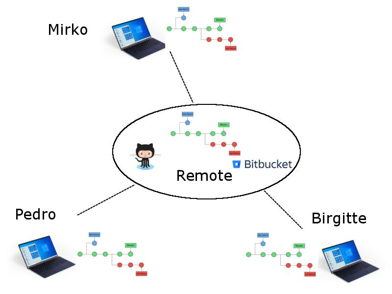


---

## Updated scheme for file stages

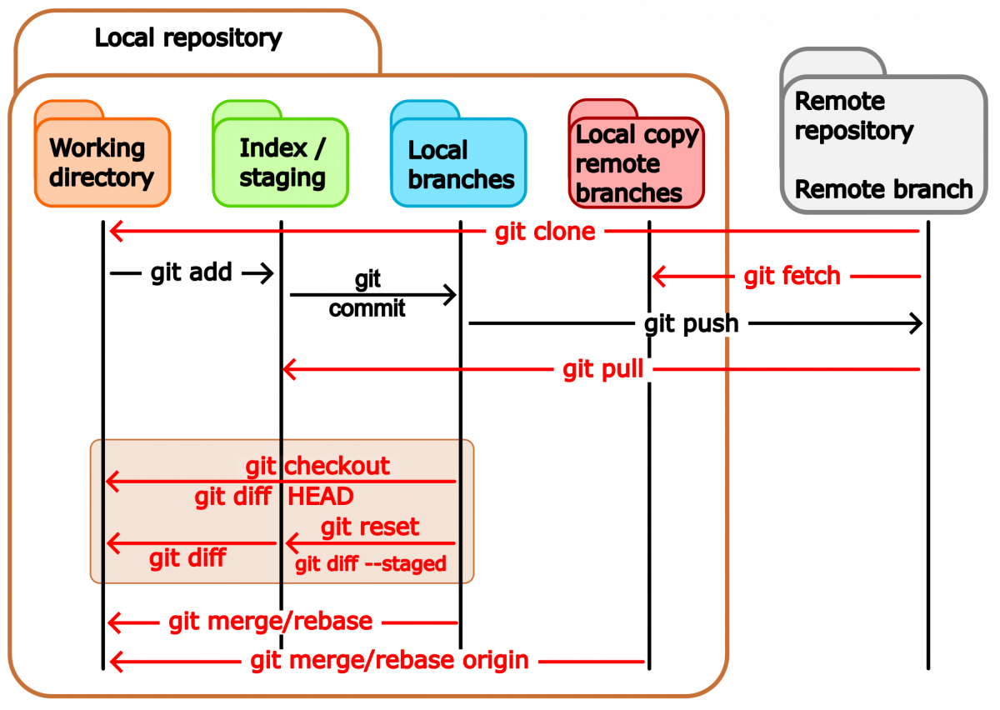

---

## Concepts cont.
The command 

```java
$ git remote -v
origin  git@bitbucket.org:arm2011/gitcourse.git (fetch)
origin  git@bitbucket.org:arm2011/gitcourse.git (push)
```


displays the remotes that are already set up where you can *fetch* and *pull* changes. In this case there is only a single remoted called **origin**.

---


```java
$ git graph
* 2e56d0a (HEAD -> main, origin/main, origin/HEAD) text of exercise git diff usage
* 22a7316 Adding yet more lectures
* 0ddb791 Adding some more of the lectures
* 3ff9f8f Adding some of the lectures
```

---

## Adding remotes

A remote repository can be added manually with the command

```java
$ git remote add remote_name location

$ git remote add remote_name git@github.com:aliceuser2020/my-first-project.git

$ git remote -v
remote_name	git@github.com:aliceuser2020/my-first-project.git (fetch)
remote_name	git@github.com:aliceuser2020/my-first-project.git (push)
```

where the location of the remote can be an URL or the path if that is in your local machine.


---

Protocols:

- local ->  git clone /opt/git/project.git
- SSH   ->  git clone ssh://user@server:project.git
- HTTP  ->  git clone http://example.com/gitproject.git
- Git


---

Why do we need more than one remote?

  
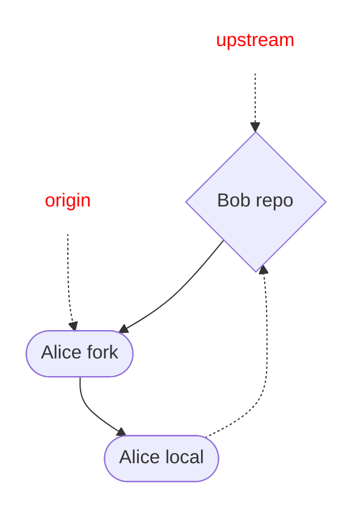

---


```java
$ git remote add upstream git@github.com:bob/my-first-project.git

$ git remote -v
origin	git@github.com:aliceuser2020/my-first-project.git (fetch)
origin	git@github.com:aliceuser2020/my-first-project.git (push)
upstream	git@github.com:bobuser2020/my-first-project.git (fetch)
upstream	git@github.com:bobuser2020/my-first-project.git (push)
```


---

```java
$git graph
* 2e56d0a (HEAD -> main, upstream/main, origin/main, origin/HEAD) text of exercise git diff usage
* 22a7316 Adding yet more lectures
* 0ddb791 Adding some more of the lectures
* 3ff9f8f Adding some of the lectures
```

---

## Working with remotes
One can push or fetch/pull to or from remotes:

```shell
$ git push  remote_name branch_name
$ git fetch remote_name branch_name
$ git pull  remote_name branch_name 
```

---

In case you obtained the repository by cloning an existing one you will have the **origin** remote. You can do push/fetch/pull for this remote with

```shell
$ git push  origin master      
$ git fetch origin master
$ git pull  origin master
```

---

or 

```shell
$ git push
$ git fetch
$ git pull
```

because the remote *origin* and the *master* branch are configured for pushing and pulling by default upon cloning.

---

The command: 
```shell
$ git pull
```
brings all the changes (branches) that are in the remote and tries to merge them with the current branch of the local repo. The default behavior of *git pull* (*fetch* part) is in the *$GIT_DIR/config* file:
```shell
[remote "origin"]
  fetch = +refs/heads/*:refs/remotes/origin/*
```

---

In fact, *git pull* is a combination of two commands:
```shell
$ git fetch remote_name branch_name
$ git merge remote_name/branch_name
```

If you want to fetch all branches and merge the current one:

```shell
$ git fetch 
$ git merge
```

---

## Advanced
The command
```shell
$ git push 
```
will send the changes in the current branch to the remote by default.

---


The default behavior can be seen with:
```shell
$ git config --get push.default
```
This can be changed by applying:
```shell
git config --global push.default matching(default), current, ...
```

---

If you have a brand-new branch called **new**, you can push it the first time with the command:

```shell
git push -u origin new
```

which is equivalent to

```shell
git push origin new
git branch --set-upstream new origin/new
```

---

then, you will be able to push/pull the changes in the branch by simply typing **git push/pull**

---

### Displaying remote information

```console
$ git remote show origin
* remote origin
  Fetch URL: git@bitbucket.org:arm2011/gitcourse.git
  Push  URL: git@bitbucket.org:arm2011/gitcourse.git
  HEAD branch: master
  Remote branches:
    experiment     tracked
    feature        tracked
    less-salt      tracked
    master         tracked
    nested-feature tracked
  Local branches configured for 'git pull':
    feature        merges with remote feature
    master         merges with remote master
    nested-feature merges with remote nested-feature
  Local refs configured for 'git push':
    feature        pushes to feature        (fast-forwardable)
    master         pushes to master         (up to date)
    nested-feature pushes to nested-feature (up to date)
```

---

### Renaming remotes

```shell
$ git remote rename initial_name new_name
```

### Deleting remotes

```shell
$ git remote remove remote_name 
```


---

## Bare repositories

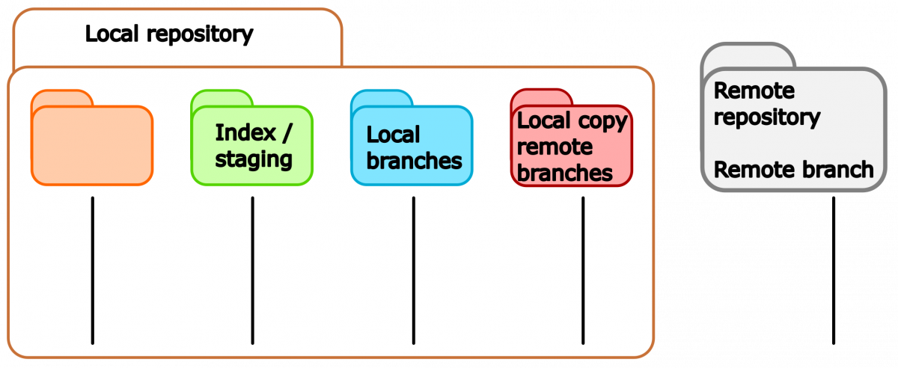


A bare repository is a repository with no working directory.

---

### Creating a bare repository

```shell
$ mkdir bare.git && cd bare.git
$ git init --bare
```

### Cloning a bare repository cont.

```shell
$ git clone --bare location
```

---

## Using GitHub

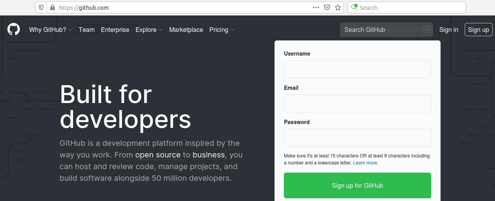


---

Upon login into your GitHub account you will see the following option to create a new repository

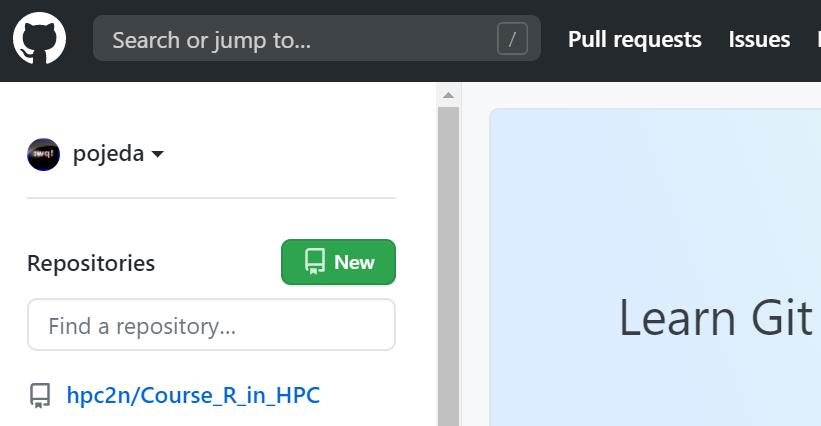

---

Here, you can choose the type of repository that is appropriate to your needs (public/private), if you want to add *README* and *.gitignore* files and also the type of license for your project,

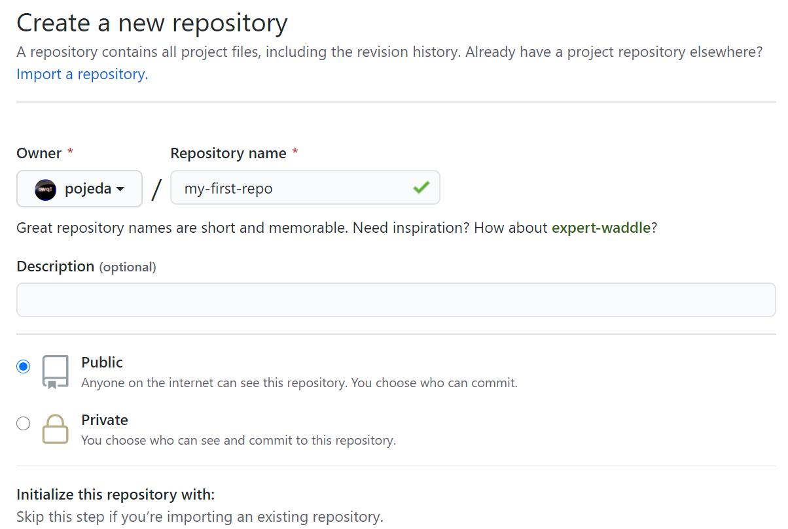

---

GitHub will suggest some steps that you can take for your brand-new repository:

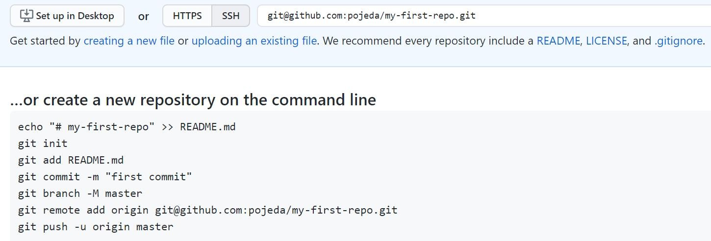

---


---

## Setting ssh-keys

1. ssh-keygen -t rsa -b 4096 -C "pedro@gemail.com"
2. eval $(ssh-agent -s)
3. ssh-add ~/.ssh/id_rsa
4. clip < ~/.ssh/id_rsa.pub (it copies the ssh key that has got generated)


---

5. Go to your remote repository on github.com and then **Settings** -> **SSH and GPG keys** ->new SSH key -> write a title and paste the copied SSH key and save it
6. check if the key was properly set on github/bitbucket 

```
$ ssh -T git@bitbucket.org
$ ssh -T git@github.com
```


---

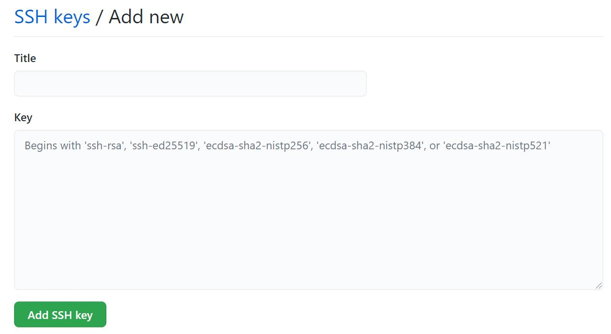

---

## Network visualization
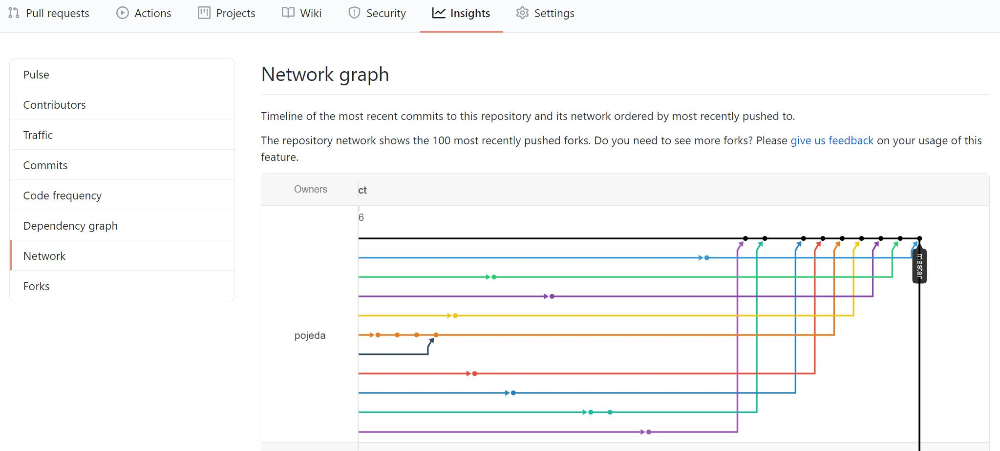


---

## Working with other's repos
In the following scenario, a developer, Bob, has its repo on GitHub. Another developer, Alice, finds it useful. Alice can clone it but she cannot push changes unless Bob allows it:

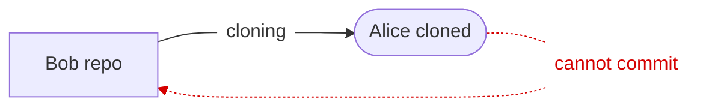

---

A better approach is to *fork* Bob's repository: 

```mermaid
graph LR
  bob["Bob's repo (upstream)"] 
  alicef(["Alice's repo (origin)"])
  alicel(["Alice local copy (PC/laptop)"]) color=darkgreen fontcolor=darkgreen]
  "Alice fork" -> "Alice local" [label="cloning"]
  "Alice local" -> "Alice fork" [label="can commit"]
  "Alice local" -> "Bob repo" [label="cannot commit" fontcolor=red color=red style=dashed]
  "Bob repo" -> "Alice fork" [label="forking"]
  "Alice local" -> "Bob repo" [label="can request pulls" fontcolor=blue color=blue style=dashed]
```
In this way, Alice can push changes to her repository and eventually make Bob aware of them as well.

---

<!-- .slide: data-background="#ffffff" -->
## Forking a repository
To fork a repository, Alice go to the URL of the target repository and use the option *Fork* in Bob's repository: 


---

<!-- .slide: data-background="#ffffff" -->
## Forking a repository
Then, Alice will see the forked repository on her user space:


---

<!-- .slide: data-background="#ffffff" -->
After doing some changes, Alice push them to her forked repository but she wants Bob become aware of them (1 commit in this case, click on this commit)


---

<!-- .slide: data-background="#ffffff" -->
## Pull request
A **pull request** will be suggested: 


---

<!-- .slide: data-background="#ffffff" -->
You can then create a the PR:


---

<!-- .slide: data-background="#ffffff" -->
Another way to create PR is with "Pull request" option:


---

<!-- .slide: data-background="#ffffff" -->
<!-- .slide: style="font-size: 30px;" -->

Then, Bob receives an email with the pull request information about Alice modifications. On the GitHub site he sees the request:


---

<!-- .slide: data-background="#ffffff" -->
Because Bob find the changes from Alice useful and there are no conflicts he can merge them, 


---

<!-- .slide: data-background="#ffffff" -->
## Issues
If you find some issues in the files/code you can open an "Issue" on GitHub


---

<!-- .slide: data-background="#ffffff" -->


---

<!-- .slide: data-background="#ffffff" -->
You may also assign people to the issues that are more related to that topic. 

In future commits you may refer to this issue by using the issue number, <span style="color:blue">#2</span> in this case. This will allow you to track the evolution of the issue on GitHub.

---

<!-- .slide: data-background="#ffffff" -->
## Best practices

- Communicate with your colleagues.
- Some commands such as **git rebase** change the history. It wouldn't be a good idea to use them on public branches. 
- Don't accept pull requests right away.


