# Answers to exercises for section 3. Basic concepts

1. Create a repository, add (stage) and commit a file

**Steps:**

```bash
mkdir repository 
cd repository 
git init 
nano file.txt 
git add file.txt 
git commit -m "This is quite interesting" 
```

**Answer:**

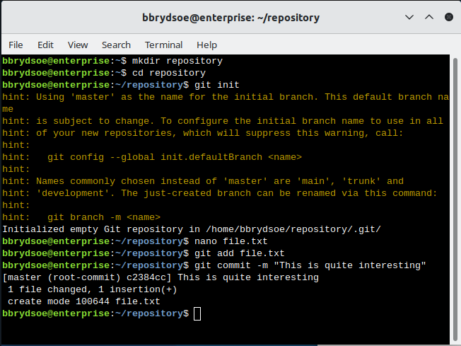

Note that you need to write something in the nano editor in order for it to save the file: 

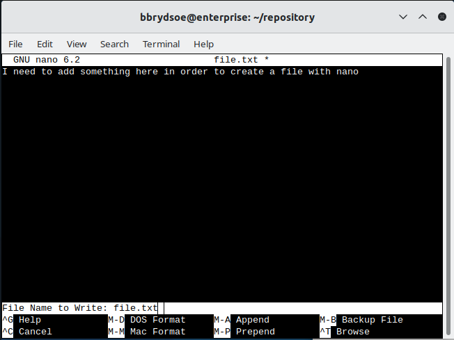

---

2. Take a look at the stuff under the .git directory

**Steps:**

```bash
cd repository
tree .git 
git cat-file -p <hash> 
```

where <hash> is the various hash'es you can see with

```bash
tree .git
```

Remember that the two-letter name of the subdirectory under objects-dir is included in the hash

**Answer:** 

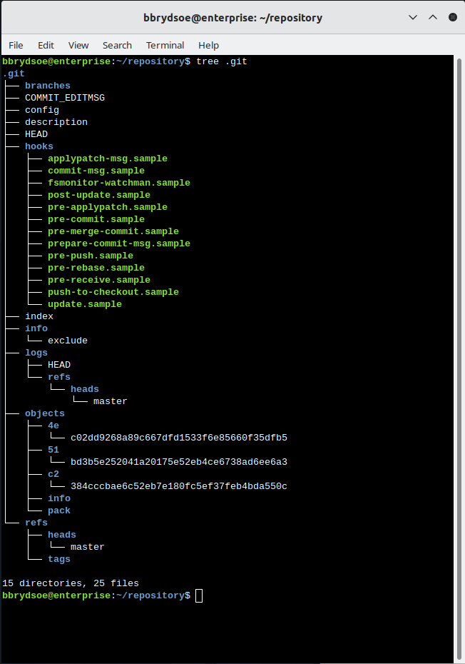

If you do not have ``tree`` on your system, you can use ``find``. 

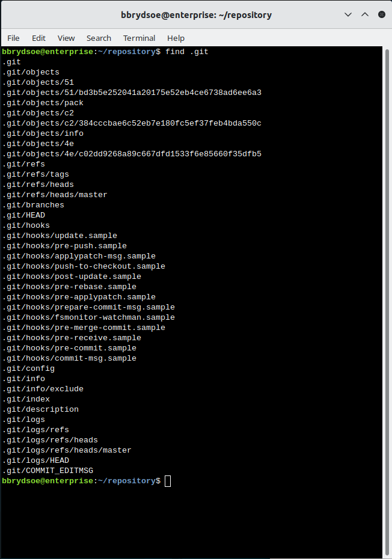 

Then do cat-file on a hash: 

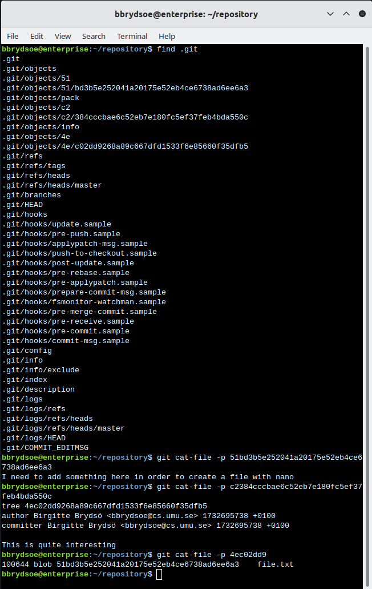 

!!! note

    Note that you include the two-letter name of the subdirectory in the hash! 

---

3. Make some changes.

Change one or more files. Add and commit. Make some changes. Add and commit.

Look at what happens in the .git tree

**Answer:** 

I will be using ``find`` 

Making a change: 

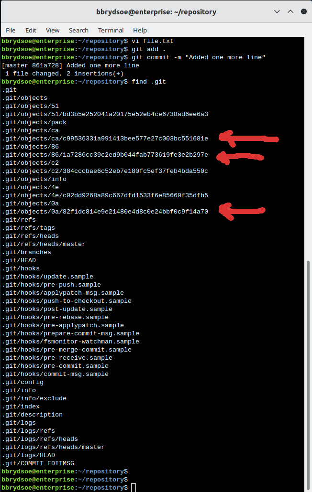

Making another change: 

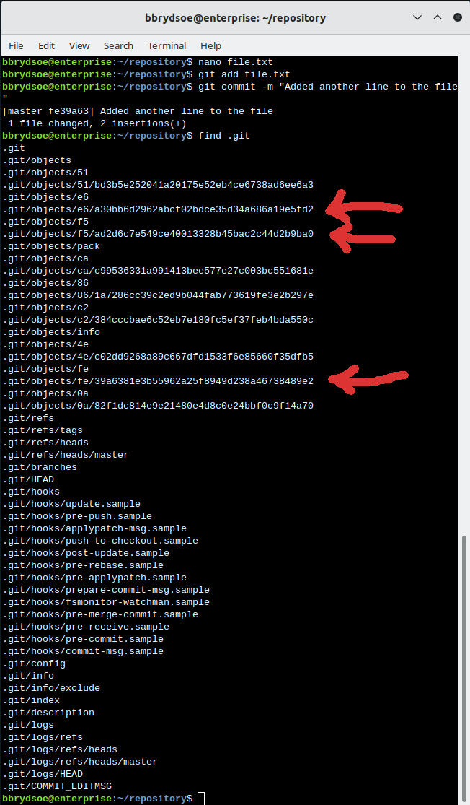

---

4. Go to earlier commits and make a new branch

**Steps:** 

Try go back to an earlier commit with “git checkout <hash>” 

Make come changes to a file there, or try adding a new file (and add+commit) 

Create a new branch from that commit: “git checkout -b second_branch” 

Find the hash of the commit the HEAD points to now  

```bash 
cat .git/HEAD    
cat <path you got above> 
git cat-file -p <hash you just got from above command> 
```

**Answer:** 

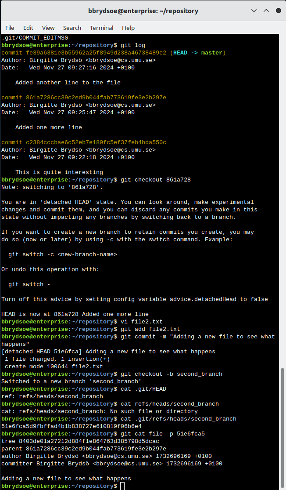

---

5. Go back on primary branch and merge the branches

**Steps:** 

Go back to the primary branch (main or master) with “git checkout main” or “git checkout master” 

Merge the new branch you created to master with “git merge --no-ff second_branch” (or whatever you called the new branch) 

**Answer:**

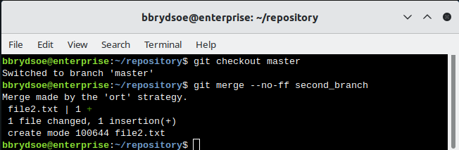

Note that here there was no conflict. 

And this is how it looked when it opened the merge message (in vim): 

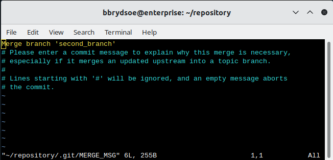

I make no change, just save/close the editor and the merge continues as shown in image above this image. 

An easy way to get conflicts is to edit the same file in the same line on both branches, then adding and committing on both branches before trying to merge second_branch to master (on master branch). 

This is how it looks when there are conflicts: 

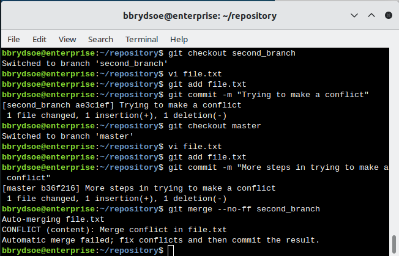 

Fix any conflict by going into the conflicting file(s) and removing the stuff you don’t want and also the git markers set there 

This is how it looks in the file, when there are conflicts: 

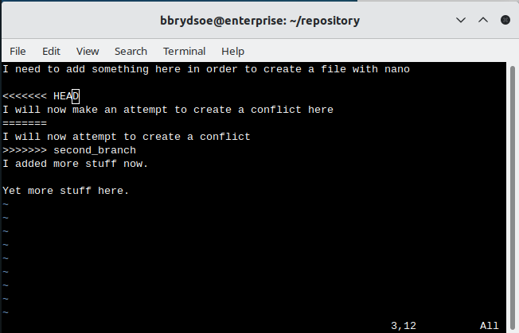 

Remove the git markers and also fix the file as you want it to be (which lines should be there, etc.). I did like this: 

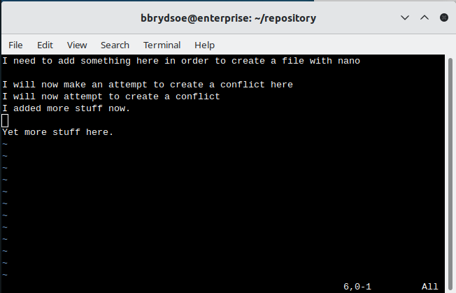 

Add the fixed file and do “git merge --continue"  

Now look at what the HEAD is pointing to 

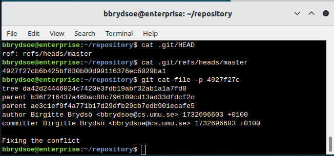 

---

6. Check out the commit tree   

You can also just try jump around in the commit tree with “git checkout <hash>” and see how your working tree looks in various places (see that files are there or not, and with different content).

You get the list of hash’s and commit messages with “git log” 

**Answer:** 

This is how it looks for me: 

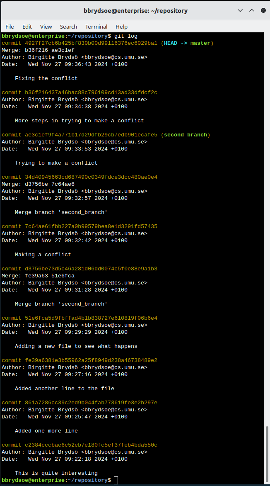 

To look at a specific commit, do 

``git checkout <hash>``

for one of the hash'es. 

You could then use 

``git cat-file -p <hash>``

to check on the files. 
 
