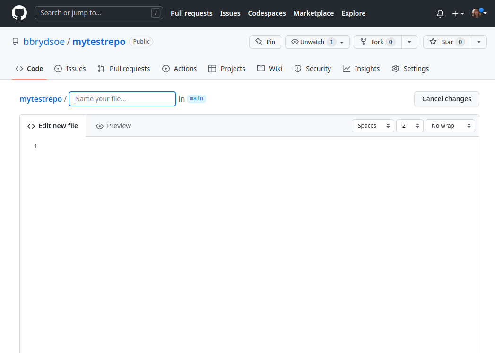
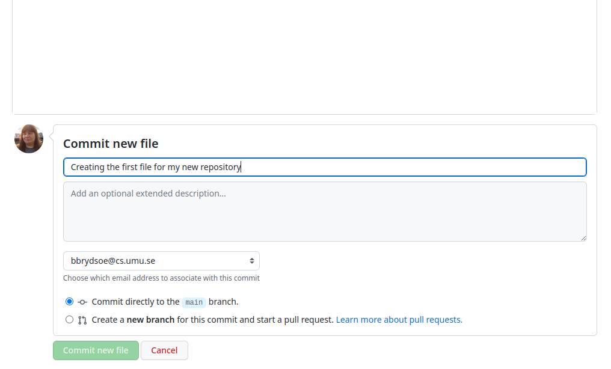
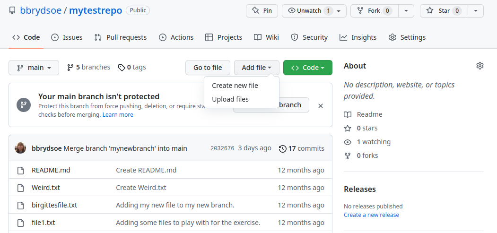
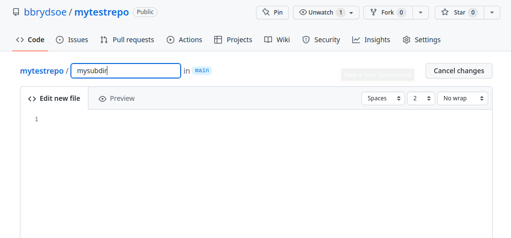
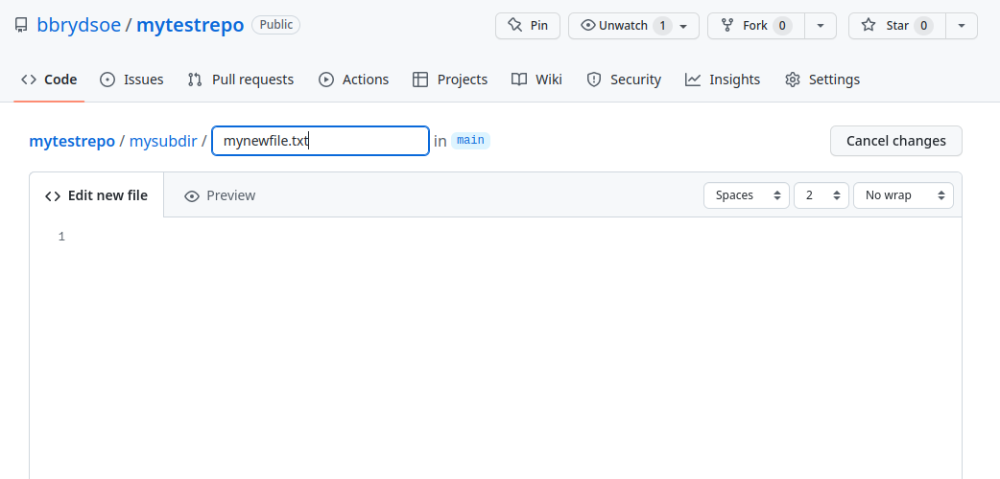
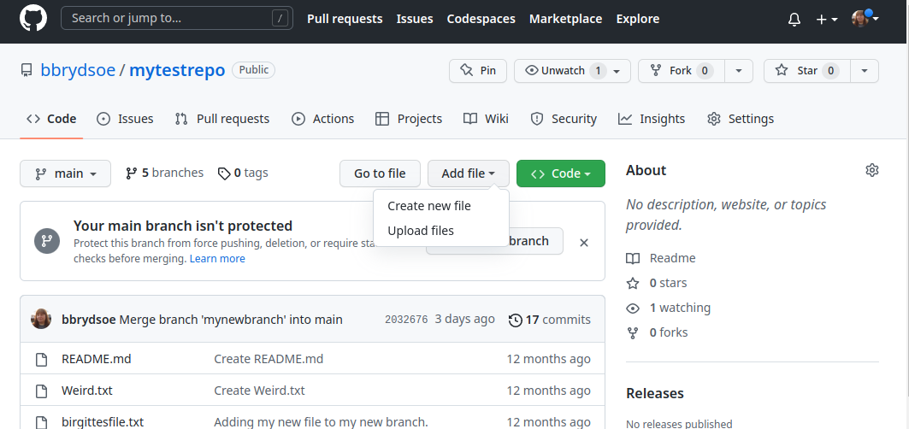
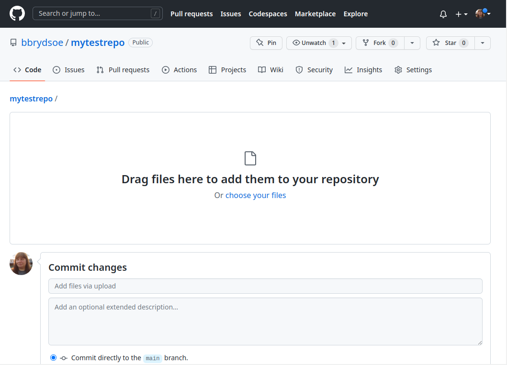
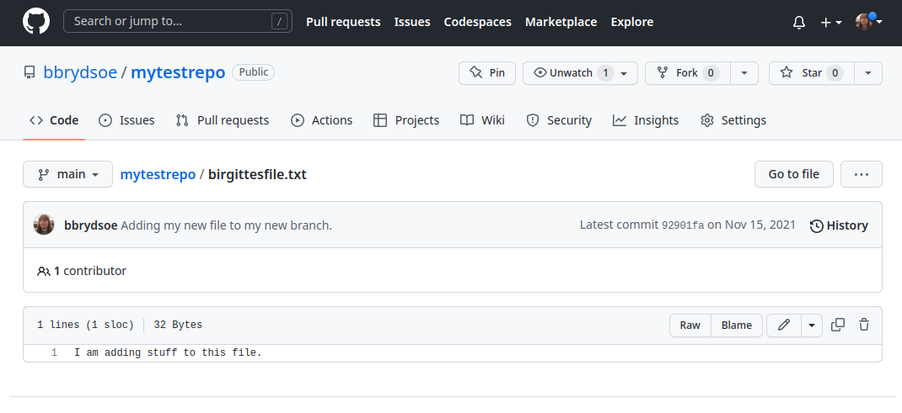
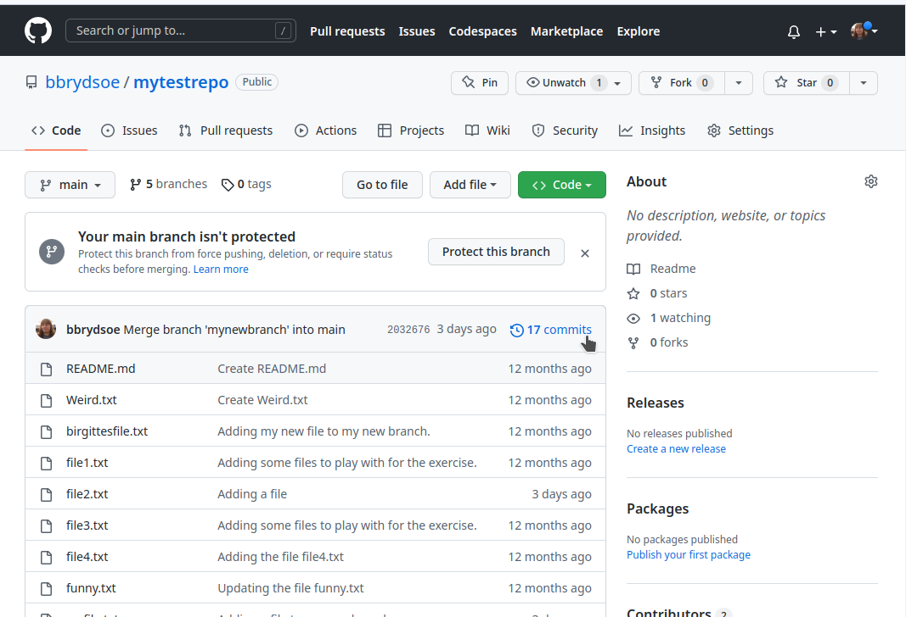
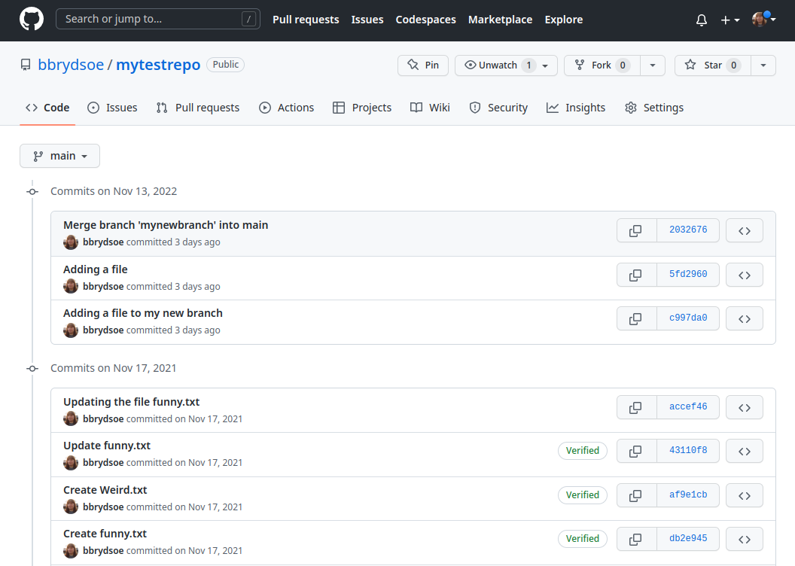

# 1. Setting up a repository on GitHub - model solutions 

In this exercise you create a repository on GitHub and work with that. 

You will be working on the GitHub website (so you need to have signed up for an account). 

1. Create a repository: 

	On the GitHub webpage the option to create a new repository is in the top right corner: click the “+”. 

	
	

2. Create a first file on the website:

	Under "Quick setup" which is shown just after creating the repo, pick "creating a new file".

3. You should name this file "README.md". 
 
	The name of the file should be put at the top, over the file editor. 
	

4. Put some text in the file. 

	Since this file will be shown directly when people enter the repository, it should contain something descriptive about what they will find, etc. 

5. Write a commit message

	At the bottom, where it says "Commit new file" you should put a useful commit message. 

6. Then click the green button named "Commit new file"

	

Aside from the README.md file, it is often also good to have a LICENSE.md file if you are working on a larger project, are creating some software, etc. 

In addition you may want to have a .gitignore file for the files that should not be tracked by Git. 

7. Creating a new file 

	To create a file from the GitHub website, click "Add file" -> "Create new file".  

	

	To create a subdirectory, add the name of the new subdirectory after the name of your repo, then add a "/", then your filename. 

	The moment you place the "/" GitHub will realize you want to create a directory there, as seen in these figures: 

	
	

8. Create a file on your computer and upload it to GitHub through the web interface: 

	
	

Remember to write a good commit message!

9. Make some edits to your files, through the web interface. 

	a) Click the file you want to edit
	b) Click the "pen" symbol at the right side above the file content. 

	

When you have edited the file, remember to write a good commit message (under the area "Commit changes" at the bottom). Click "Commit changes". 

10. If you make subdirectories you may sometimes want to create a description for people to see when they enter it on GitHub. Do that by creating a file named "README.md". 

11. Now when you have made several commits, try clicking the "commits" above the files in the repo and see a list of your commits. 

	
	

You can click on a commit for more information. 

 
