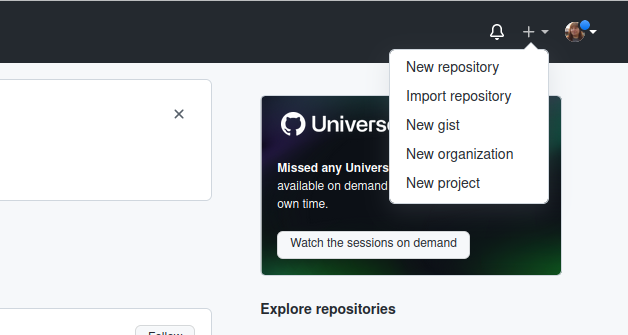
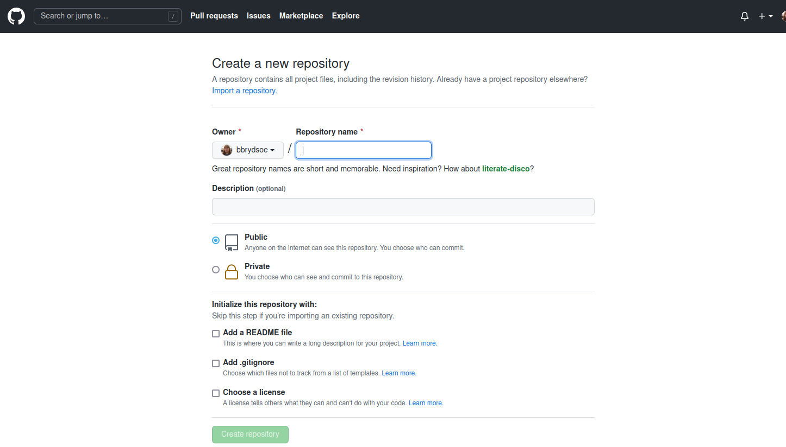
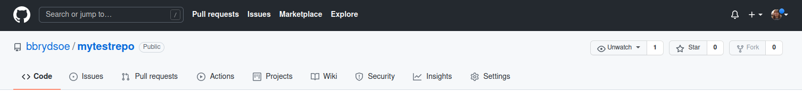
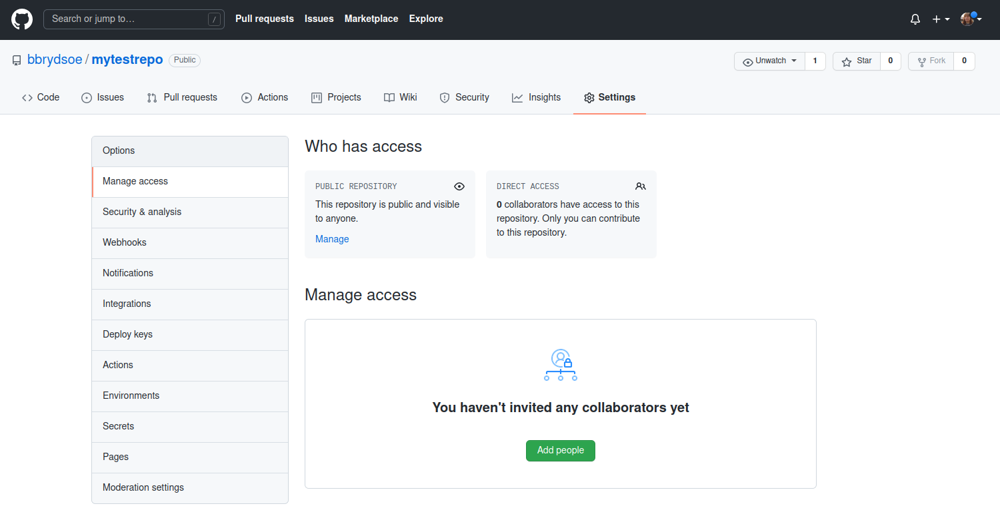

# Clone, push, and pull - model solutions 

In this exercise you will work with a repository on GitHub that one of you creates. 

You will be using your GitHub username and password for this exercise

**NOTE**: You will ONLY do the first exercise in this set since GitHub no longer allows password access for push etc. 

1. One of you should create a repository on GitHub and invite their team members. 

   On the GitHub webpage the option to create a new repository is in the top right corner: click the “+”. 

   To add members to your repository, go to “Settings” -> “Manage access”.

   The team members must accept the invitation. 

**Solution** 

Create a new repository: 

Go to settings and then Manage access to "Add people". Search by username, full name, or email. The person you are adding needs to have a GitHub account. 

 

--- 
Do not try to do the exercises below using password authentication. It will no longer work! You will do similar exercises using SSH access in the next exercise 
---

2. Everyone clones the repository to their local machine, using `git clone`. 

   NOTE: Use the HTTPS address (click CODE to find it). See example:

3. Each person then creates a file and puts it to the repository (`git add`, `git commit`, `git push`)

   NOTE: To avoid errors, do `git pull` before you stage and commit your file and use unique names for your files. 

4. See the changes appear to your local repository after `git pull`. 

   You could check with `git log` and `git status`. 

5. Optionally, you could try to push your new change before pulling the changes your team members have made. Git will complain, but you should be able to solve this kind of simple problem with `git pull --rebase` before you do `git push`

