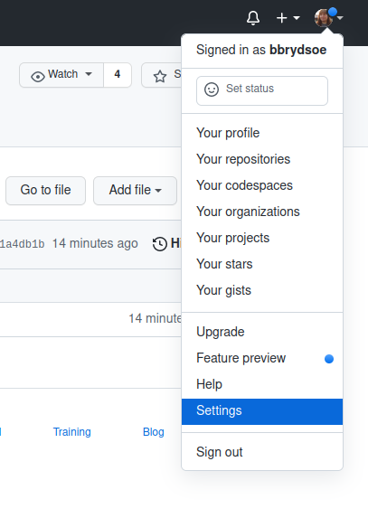
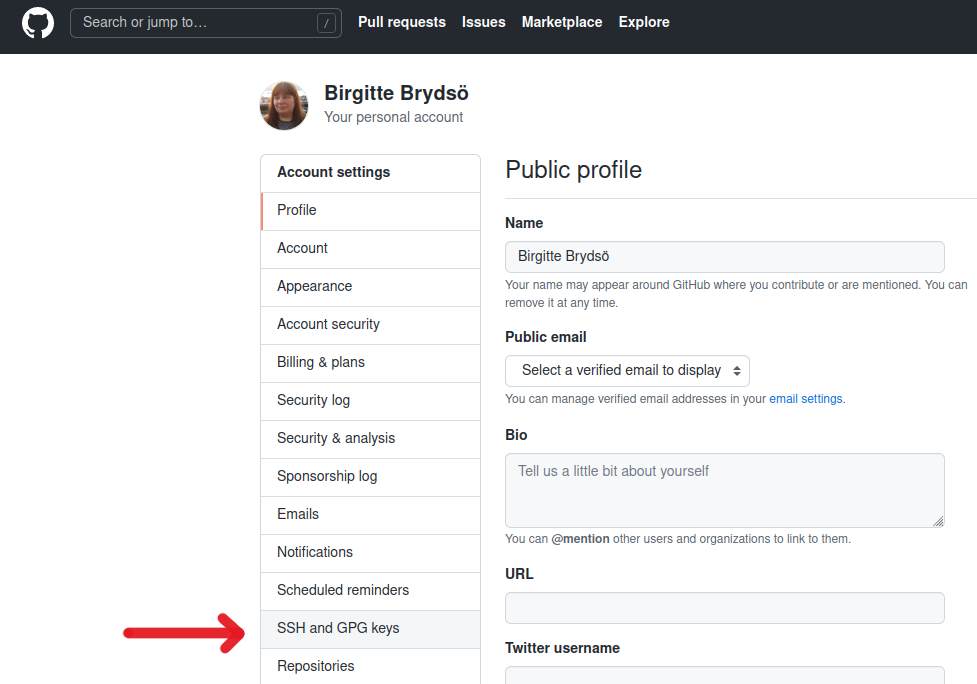
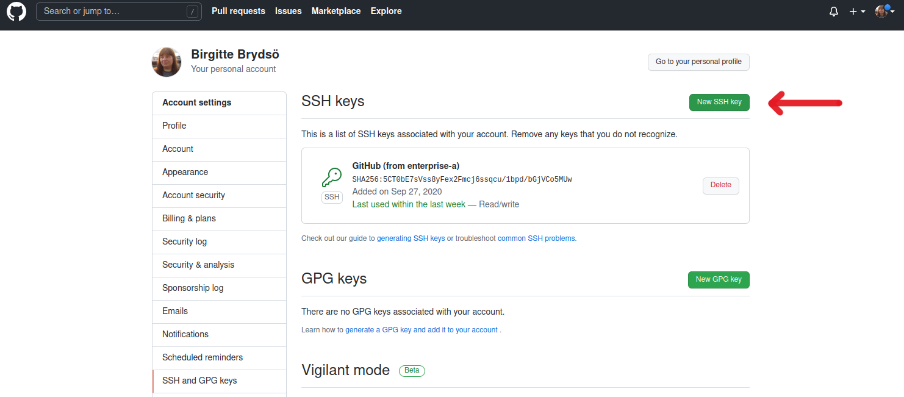
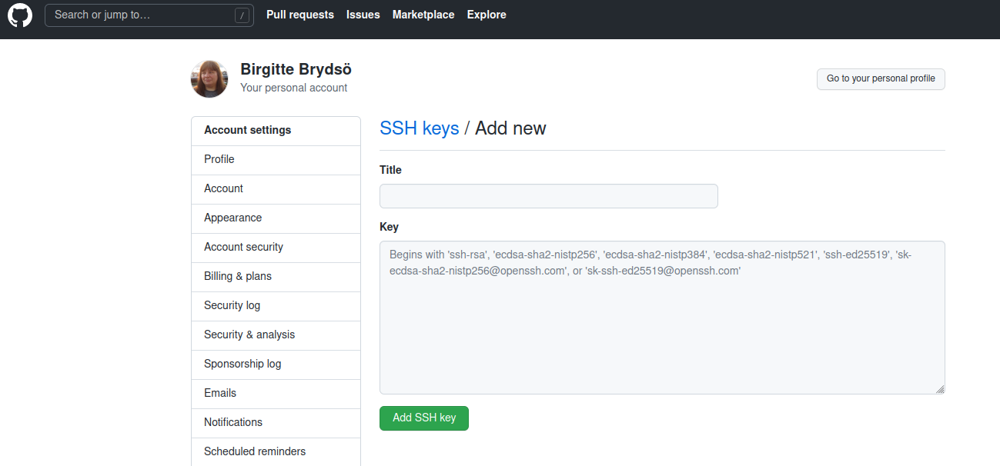

# Creating and using SSH-keys

In this exercise you create SSH keys and upload to GitHub. Then test that it works. 

Everyone in the team should do this! 

**Create a new SSH key**

1. Open a terminal. If you are using Windows, you should use Git Bash. 

	In the command below, "GitHub" is a label added to the key for clarity. Often your email address is used. You can add any you want: 

	If your system is running a fairly new version of SSH, do this: 

	```
	$ ssh-keygen -t ed25519 -C "GitHub"
	```

	If this does not work because your version of SSH is older, then instead use this: 

	```
	$ ssh-keygen -t rsa -b 4096 -C "GitHub"
	```

2. You will be asked for a file to save the key. 

	Unless you have an existing SSH key, accept the default name. If you already have SSH keys, use a different name. 

	It will then likely be saved in the subdirectory .ssh and be called either id_ed25519 or id_rsa. 

3. You will have to enter a passphrase and repeat it. 

	Pick something you can remember as you will enter it whenever you are pushing something to the remote repository on GitHub. 

	Now check the name of the keys. It will probably be in the .ssh directory. You may have to turn on viewing "hidden files" if you are on Windows.   

4. Add the key to the ssh-agent. Here we assume the default name. Do ONE of the following: 

	```
	$ eval "$(ssh-agent -s)"

	$ ssh-add ~/.ssh/id_ed25519
	```

	or 

	```
	$ eval "$(ssh-agent -s)"

	$ ssh-add ~/.ssh/id_rsa
	```

	Remember, if you gave your keys a different name, then use that! 

	The following is one example of how it could look to create the keys: 

	```shell
	bbrydsoe@enterprise-a:~$ ssh-keygen -t rsa -b 4096 -C "GitHub"
	Generating public/private rsa key pair.
	Enter file in which to save the key (/home/bbrydsoe/.ssh/id_rsa): 
	Enter passphrase (empty for no passphrase): 
	Enter same passphrase again: 
	Your identification has been saved in /home/bbrydsoe/.ssh/id_rsa
	Your public key has been saved in /home/bbrydsoe/id_rsa.pub
	The key fingerprint is:
	SHA256:pp1kEoMRV1p7c37D8QV9ae/DzmTtl/YQ2p4+3/cD1fw GitHub
	The key's randomart image is:
	+---[RSA 4096]----+
	|    o...o     ...|
	|     + o .     +o|
	|    . + . o . o.=|
	|       o . + . +=|
	|      . S   . B.+|
	|       B .   = BE|
	|      . o   . O.o|
	|             ..O=|
	|             .=o@|
	+----[SHA256]-----+
	```

5. Copying the content of the public part of the key pair. 

	a) Switch to the `.ssh` folder
	b) Open the file `id_ed25519.pub` or `id_rsa.pub` in any editor and copy ALL of it. Do NOT add any newlines or whitespace! 

**Adding the SSH key to GitHub**

1. On GitHub, click your avatar in the top right corner and pick "Settings".

	

2. Choose "SSH and GPG keys"

	

3. Click "Add new SSH key"

	If you do not have a key there already, GitHub will not list a key as it does for me.

	

4. Add a descriptive label for the key in the "Title" field. In the key field you paste the content of the key (~/.ssh/id_ed25519.pub or ~/.ssh/id_rsa.pub or whatever you named it)

	Enter the ENTIRE content of the key file: 

	

	Click "Add SSH key". 

**Testing the SSH keys**

1. Open a terminal

2. `$ ssh -T git@github.com`

3. It will look similar to this: 

	```
	$ ssh -T git@github.com
	The authenticity of host 'github.com (140.82.121.4)' can't be established.
	RSA key fingerprint is SHA256:nThbg6kXUpJWGl7E1IGOCspRomTxdCARLviKw6E5SY8.
	Are you sure you want to continue connecting (yes/no)? yes
	Warning: Permanently added 'github.com,140.82.121.4' (RSA) to the list of known hosts.
	Enter passphrase for key '/home/bbrydsoe/.ssh/id_rsa': 
	Hi bbrydsoe! You've successfully authenticated, but GitHub does not provide shell access.
	```

4. Verify that the resulting message contains your username. 

5. NOTE: Optionally, you could run `ssh-add` to add the key. Then you will only be asked for the passphrase once per session. This is relatively safe on Linux and macOS, but not on Windows where it usually saves the key passphrase permanently.

