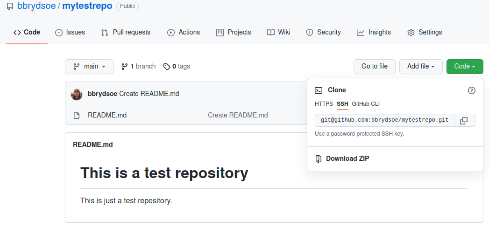

# Creating and using SSH-keys

It is easier to use SSH keys than to enter the GitHub username and password every time. In this exercise you create SSH keys and upload to GitHub. Then test that it works. 

Everyone in the team should do this! 

**Create a new SSH key**

1. Open a terminal. In the command below, "GitHub" is a label added to the key for clarity. Often your email address is used. You can add any you want: 

```
$ ssh-keygen -t rsa -b 4096 -C "GitHub"
```

2. You will be asked for a file to save the key. Unless you have an existing SSH key, accept the default.

3. Enter a passphrase and repeat it.

4. Add the key to the ssh-agent. Here we assume the default name: 

```
$ eval "$(ssh-agent -s)"

$ ssh-add ~/.ssh/id_rsa
```

**Solution** 

Doing the above four parts (for the case of using the default name - remember, if you already have SSH keys, give a different file to save the key in below): 
```shell
bbrydsoe@enterprise-a:~$ ssh-keygen -t rsa -b 4096 -C "GitHub"
Generating public/private rsa key pair.
Enter file in which to save the key (/home/bbrydsoe/.ssh/id_rsa): 
Enter passphrase (empty for no passphrase): 
Enter same passphrase again: 
Your identification has been saved in /home/bbrydsoe/.ssh/id_rsa
Your public key has been saved in /home/bbrydsoe/id_rsa.pub
The key fingerprint is:
SHA256:pp1kEoMRV1p7c37D8QV9ae/DzmTtl/YQ2p4+3/cD1fw GitHub
The key's randomart image is:
+---[RSA 4096]----+
|    o...o     ...|
|     + o .     +o|
|    . + . o . o.=|
|       o . + . +=|
|      . S   . B.+|
|       B .   = BE|
|      . o   . O.o|
|             ..O=|
|             .=o@|
+----[SHA256]-----+
```

5. Switch to the `.ssh` folder, open the file `id_rsa.pub` and copy it. Do NOT add any newlines or whitespace! 

**Adding the SSH key to GitHub**

1. On GitHub, click your avatar in the top right corner and pick "Settings".

2. Choose "SSH and GPG keys"

3. Click "Add new SSH key"

4. Add a descriptive label for the key in the "Title" field. In the key field you paste the content of the key (~/.ssh/id_rsa.pub)


5. Click "Add SSH key"

6. Confirm your GitHub password if you are prompted for it. 

**Solution**

Walk-through of the above 6 steps:

First, to copy the contents of your public key, open `id_rsa.pub` in any editor and copy ALL of the content. 

Then, open GitHub. Click on your avatar in the top right corner and pick "Settings", then choose "SSH and GPG keys": 


Now choose "New SSH key". If you do not have a key there already, GitHub will not list a key as it does for me. 


Now enter the ENTIRE content of the file ~/.ssh/id_rsa.pub (or whatever you named your key): 


Click "Add SSH key". 

**Testing the SSH keys**

1. Open a terminal

2. `$ ssh -T git@github.com`

3. It will look similar to this: 

```
$ ssh -T git@github.com
The authenticity of host 'github.com (140.82.121.4)' can't be established.
RSA key fingerprint is SHA256:nThbg6kXUpJWGl7E1IGOCspRomTxdCARLviKw6E5SY8.
Are you sure you want to continue connecting (yes/no)? yes
Warning: Permanently added 'github.com,140.82.121.4' (RSA) to the list of known hosts.
Enter passphrase for key '/home/bbrydsoe/.ssh/id_rsa': 
Hi bbrydsoe! You've successfully authenticated, but GitHub does not provide shell access.
```

4. Verify that the resulting message contains your username. 

**Using the SSH keys**

We now have SSH keys set up. Try and repeat some of the things that was done in the first exercise: 

1. Again clone the repository, but this time use the SSH address (click CODE on the GitHub repository and pick SSH). You will be asked for the key passphrase.

**Solution**

Use the SSH address (click CODE to find it). See example: 



Clone with: 
```shell
git clone <url>
```

This is how it looks for this example (remember to use your own repo-url):  

```shell
bbrydsoe@enterprise-a:~$ git clone git@github.com:bbrydsoe/mytestrepo.git
Cloning into 'mytestrepo'...
Enter passphrase for key '/home/bbrydsoe/.ssh/id_rsa': 
remote: Enumerating objects: 3, done.
remote: Counting objects: 100% (3/3), done.
remote: Compressing objects: 100% (2/2), done.
remote: Total 3 (delta 0), reused 0 (delta 0), pack-reused 0
Receiving objects: 100% (3/3), done.
```

2. Enter the local repository. Do a `git pull` and see that you no longer have to enter your GitHub username and password, but you do have to enter the key passphrase. 

**Solution**

```shell
bbrydsoe@enterprise-a:~/mytestrepo$ git pull
Enter passphrase for key '/home/bbrydsoe/.ssh/id_rsa': 
Already up-to-date.
```

3. Create a file (or edit a file). 

**Solution**

Creating a file (here named 'myfile.txt'): 

```shell
bbrydsoe@enterprise-a:~/mytestrepo$ touch myfile.txt
```

4. Add/stage the file. Commit the file. 

**Solution** 

Adding and committing the file 'myfile.txt', and also giving a commit message: 

```shell
bbrydsoe@enterprise-a:~/mytestrepo$ git add myfile.txt
bbrydsoe@enterprise-a:~/mytestrepo$ git commit -m "Adding my new file to the repository."
[main d4a666e] Adding my new file to the repository.
 1 file changed, 0 insertions(+), 0 deletions(-)
 create mode 100644 myfile.txt
```

5. Push the file. Again it will not ask for GitHub username and password, but only the key passphrase. Success! 

**Solution**

```shell
bbrydsoe@enterprise-a:~/mytestrepo$ git push
Enter passphrase for key '/home/bbrydsoe/.ssh/id_rsa': 
Enumerating objects: 4, done.
Counting objects: 100% (4/4), done.
Delta compression using up to 4 threads
Compressing objects: 100% (2/2), done.
Writing objects: 100% (3/3), 301 bytes | 301.00 KiB/s, done.
Total 3 (delta 0), reused 0 (delta 0)
To github.com:bbrydsoe/mytestrepo.git
   303bf63..d4a666e  main -> main
```

6. NOTE: Optionally, you could run `ssh-add` to add the key. Then you will only be asked for the passphrase once per session. This is relatively safe on Linux and macOS, but not on Windows where it usually saves the key passphrase permanently.

