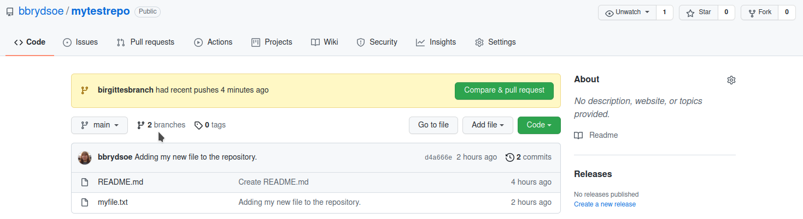

# Branches and merging 

1. Each person creates a branch with `git branch yourbranchname` where you put any name you want for the new branch. 

**Solution**

Create a branch (here named 'birgittesbranch'). Check which branch you are on. Finding that you are on the main/master branch, switch to the newly created branch: 

```shell
bbrydsoe@enterprise-a:~/mytestrepo$ git branch birgittesbranch
bbrydsoe@enterprise-a:~/mytestrepo$ git branch
  birgittesbranch
* main
bbrydsoe@enterprise-a:~/mytestrepo$ git checkout birgittesbranch 
Switched to branch 'birgittesbranch'
``` 

2. Create a uniquely named file. Put anything you want in it. 

**Solution**

This creates a file named 'birgittesfile.txt'. I then use vi to edit it, adding some text to it: 

```shell
bbrydsoe@enterprise-a:~/mytestrepo$ touch birgittesfile.txt
bbrydsoe@enterprise-a:~/mytestrepo$ vi birgittesfile.txt 
```

3. Stage and commit the file. 

**Solution**

```shell
bbrydsoe@enterprise-a:~/mytestrepo$ git add birgittesfile.txt 
bbrydsoe@enterprise-a:~/mytestrepo$ git commit -m "Adding my new file to my new branch."
[birgittesbranch 92901fa] Adding my new file to my new branch.
 1 file changed, 1 insertion(+)
 create mode 100644 birgittesfile.txt
```

Checking: 

```shell
bbrydsoe@enterprise-a:~/mytestrepo$ git status
On branch birgittesbranch
nothing to commit, working tree clean
```

All is well. 

4. Push your changes with `git push origin -u yourbranchname`

**Solution** 

```shell
bbrydsoe@enterprise-a:~/mytestrepo$ git push origin -u birgittesbranch 
Enter passphrase for key '/home/bbrydsoe/.ssh/id_rsa': 
Enumerating objects: 4, done.
Counting objects: 100% (4/4), done.
Delta compression using up to 4 threads
Compressing objects: 100% (2/2), done.
Writing objects: 100% (3/3), 367 bytes | 367.00 KiB/s, done.
Total 3 (delta 0), reused 0 (delta 0)
remote: 
remote: Create a pull request for 'birgittesbranch' on GitHub by visiting:
remote:      https://github.com/bbrydsoe/mytestrepo/pull/new/birgittesbranch
remote: 
To github.com:bbrydsoe/mytestrepo.git
 * [new branch]      birgittesbranch -> birgittesbranch
Branch 'birgittesbranch' set up to track remote branch 'birgittesbranch' from 'origin'.
```

On GitHub it looks like this. Notice that there are now 2 branches: 



Clicking on the 'branches' you get more information: 

 

Notice that you can do a 'New pull request'. 

5. When everyone has done this, all do a `git pull`

6. Use `git status`, `git branch`, and `git log` to see what has happened. 

NOTE: It is possible to make the master branch "protected" so it is not changed without a review from the owner. 

