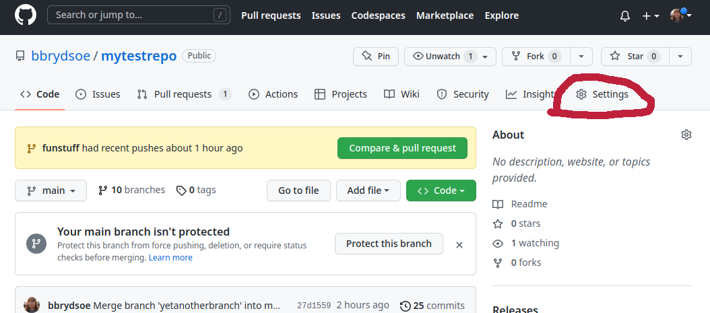
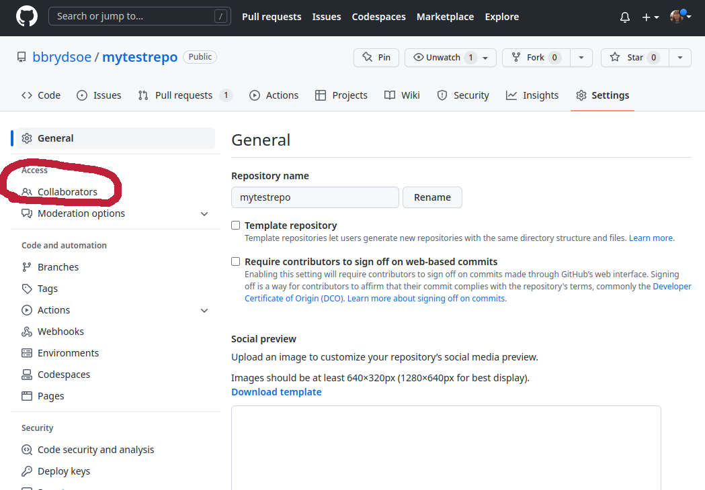

# 4. Teamwork, push and pull

One of you should create a repository on GitHub and invite their team. Remember, on the GitHub webpage the option to create a new repository is in the top right corner - click the "+". To add members: "Settings" -> "Access".




Then click "Collaborators" and then "Add people". The other members should get an invitation. Accept it and check that you have access. 

The person who owns the repository should possibly change the roles/permissions for the members if they cannot push to the repository. 

1. Each person should create a file in the repository. It is probably easiest to do from the command line. 

	- Get the link for cloning the repository: On the top level of the repository, click "CODE", then pick "SSH" and copy the link. 
	- On the command line, type `git clone <the link you copied>`. You will be asked for your passphrase. 
	- cd into the directory
	- Create a file with your favourite editor and add some stuff to it. Make sure you pick unique names for your files. 
	- Do a `git pull` to get any new material added by your team mates, then add/stage (`git add `<file>`) and commit (`git commit -m "A great commit message"`) the file.

2. Do a `git status` and a `git log --graph --oneline --decorate --all` on the command line. Check to see that the file is now tracked and committed. 

3. Do a `git push`. You will be asked to enter your passphrase. 

	- Now do `git pull` after all have added/committed/pushed their files. 
	- Do another `git status` and `git log --graph --oneline --decorate --all`.  
	- Note that your will have gotten all the new files! 

4. Again create a file and add/commit it, but do not push until your team mates have pushed their new work. Git will complain, but you should be able to solve this kind of simple problem with `git pull --rebase` before you re-do `git push`. 

	- Check with `git status` and `git log --graph --oneline --decorate --all`
	- Now do a `git pull --rebase` followed by a `git push`
	- This should solve the problem! Check status and the log again. 

5. Repeat the creating/adding/committing/pushing to see the status changes and the log changes. Make sure all try to be in the situation where they have to resolve the conflict with `git pull --rebase`.

	Example where the GitHub repo has a file that I have not pulled locally: 

	```shell
	bbrydsoe@enterprise-a:~/mytestrepo$ touch file.txt
	bbrydsoe@enterprise-a:~/mytestrepo$ git add file.txt
	bbrydsoe@enterprise-a:~/mytestrepo$ git commit -m "Adding a file to see git complain"
	[main ed63f83] Adding a file to see git complain
	 1 file changed, 0 insertions(+), 0 deletions(-)
	 create mode 100644 file.txt
	bbrydsoe@enterprise-a:~/mytestrepo$ git push
	Enter passphrase for key '/home/bbrydsoe/.ssh/id_rsa': 
	To github.com:bbrydsoe/mytestrepo.git
	 ! [rejected]        main -> main (fetch first)
	error: failed to push some refs to 'git@github.com:bbrydsoe/mytestrepo.git'
	hint: Updates were rejected because the remote contains work that you do
	hint: not have locally. This is usually caused by another repository pushing
	hint: to the same ref. You may want to first integrate the remote changes
	hint: (e.g., 'git pull ...') before pushing again.	
	hint: See the 'Note about fast-forwards' in 'git push --help' for details.
	bbrydsoe@enterprise-a:~/mytestrepo$ git pull --rebase
	Enter passphrase for key '/home/bbrydsoe/.ssh/id_rsa': 
	remote: Enumerating objects: 3, done.
	remote: Counting objects: 100% (3/3), done.
	remote: Compressing objects: 100% (2/2), done.
	remote: Total 3 (delta 0), reused 0 (delta 0), pack-reused 0
	Unpacking objects: 100% (3/3), 932 bytes | 466.00 KiB/s, done.
	From github.com:bbrydsoe/mytestrepo
	   2032676..9f7e352  main       -> origin/main
	First, rewinding head to replay your work on top of it...
	Applying: Adding a file to see git complain
	bbrydsoe@enterprise-a:~/mytestrepo$ git push
	Enter passphrase for key '/home/bbrydsoe/.ssh/id_rsa': 
	Enumerating objects: 3, done.
	Counting objects: 100% (3/3), done.
	Delta compression using up to 4 threads
	Compressing objects: 100% (2/2), done.
	Writing objects: 100% (2/2), 259 bytes | 259.00 KiB/s, done.
	Total 2 (delta 1), reused 0 (delta 0)
	remote: Resolving deltas: 100% (1/1), completed with 1 local object.
	To github.com:bbrydsoe/mytestrepo.git
	   9f7e352..6be6d4a  main -> main
	bbrydsoe@enterprise-a:~/mytestrepo$
	```

