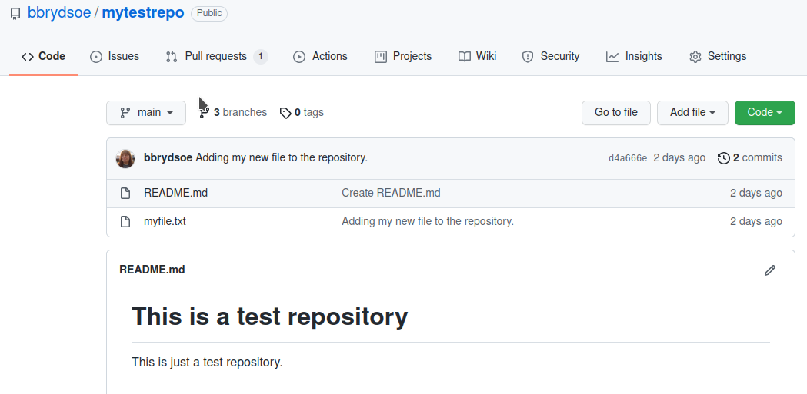
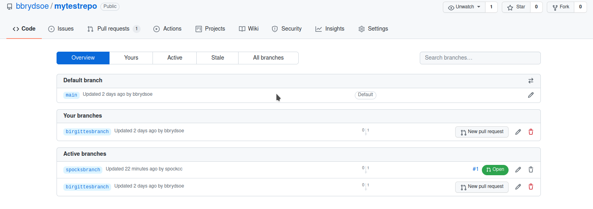
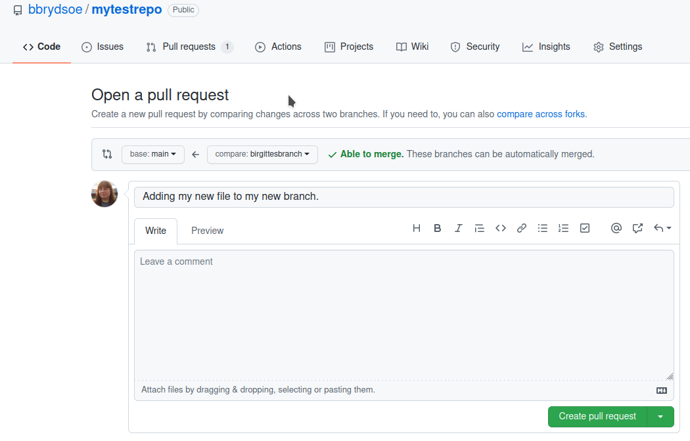
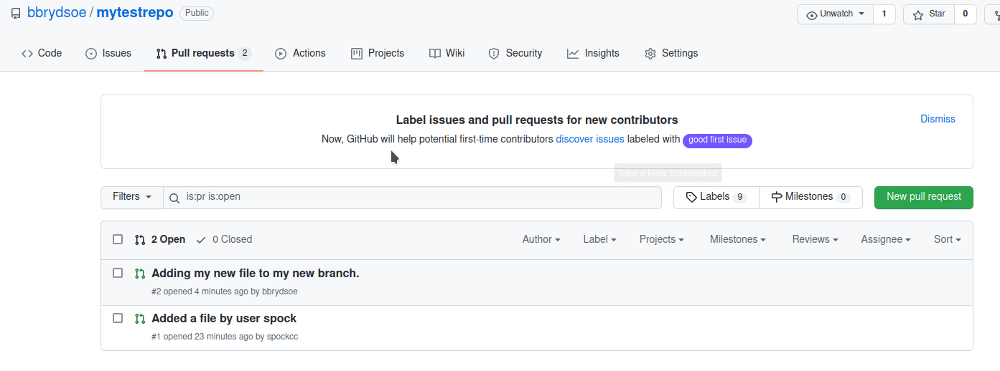
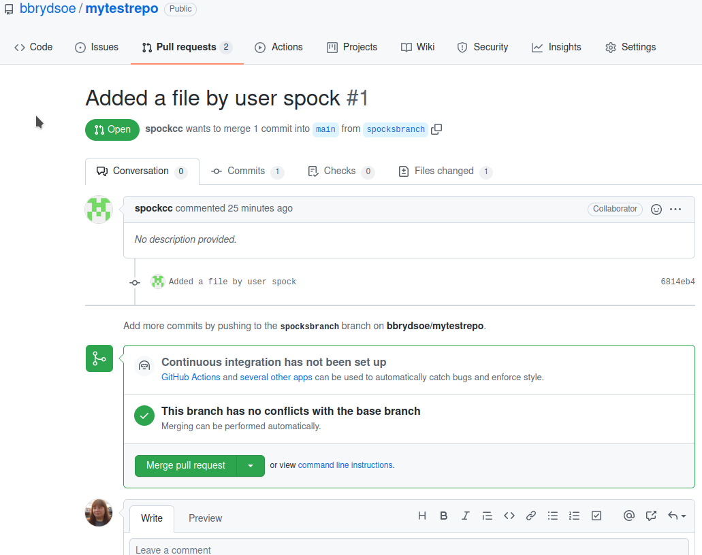
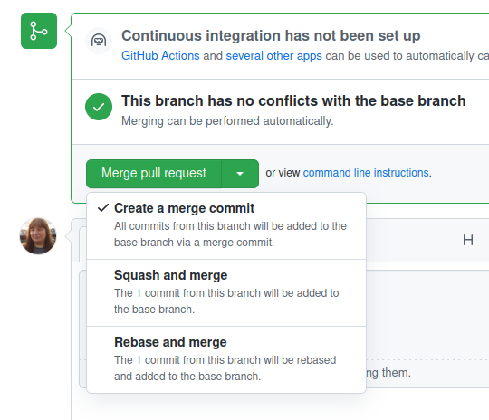
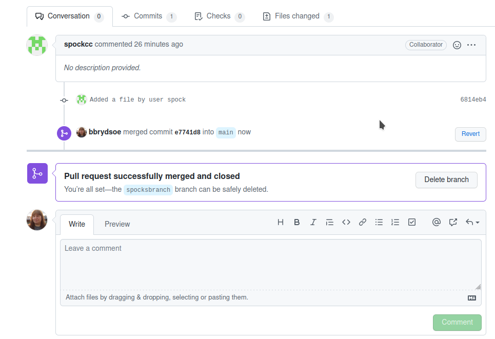

# Branches and merging - continued

Immediate continuation of exercise 3. We are working on the repository and files. 

We are assuming you created your own branch and added stuff to it. Now we will merge that branch to the master branch. 

1. Go to the repository on the GitHub page. Submit a pull-request from your branch to the master branch 

**Solution** 

Go to your repository on GitHub and click on 'branches' (in my example it shows 3 branches - main, birgittesbranch, spocksbranch): 



You can also see in the picture that I have a pending pull request (because I am the owner of the repository). 

This is how it looks after I clicked on 'branches': 



Under 'Your branches' you can click on 'New pull request' to create a pull request: 



Add a comment and click 'Create pull request'. 

2. The owner of the repository (the person who created it) can then accept them and click to merge them.

**Solution** 

Now the owner of the repository can go handle the open pull requests. The owner of the repository should click on 'Pull requests'. They then get something like this: 



Click on them one at a time and handle them: 



Git checks and says that the merge can be done automatically. It gives you options: 

 

Just pick the first one, 'Merge pull request'. The branches are merged, and you are told you can now go and delete the branch: 

 

Handle the remaining pull requests. 

3. After doing so, everyone should again do a `git pull`

**Solution** 

Remember to change to the main branch first! Your own branch will not contain the new changes. That is not the one that anything got merged to. 

```shell
brydsoe@enterprise-a:~/mytestrepo$ git checkout main
Switched to branch 'main'
Your branch is behind 'origin/main' by 4 commits, and can be fast-forwarded.
  (use "git pull" to update your local branch)
bbrydsoe@enterprise-a:~/mytestrepo$ git pull
Enter passphrase for key '/home/bbrydsoe/.ssh/id_rsa': 
Updating d4a666e..333d5e5
Fast-forward
 birgittesfile.txt | 1 +
 spocksfile.txt    | 0
 2 files changed, 1 insertion(+)
 create mode 100644 birgittesfile.txt
 create mode 100644 spocksfile.txt
```

If you do an 'ls' you will see that there are now more files in the directory - namely the ones created in all the other branches. 

4. Use `git status`, `git branch`, and `git log` to see what has happened.

**Solution**

'git status' gives us nothing: 

```shell
bbrydsoe@enterprise-a:~/mytestrepo$ git status
On branch main
Your branch is up-to-date with 'origin/main'.

nothing to commit, working tree clean
```

'git branch' lists your local branches (main, and unless you deleted it after the merge, the branch you created). 'git branch -r' also looks the same, except the branches that you choose to delete after the merge will be gone. 

Remember, to delete a branch, do: 

```shell
git branch -d <branch> 
```

The command 'git log' is more interesting: 

```shell
bbrydsoe@enterprise-a:~/mytestrepo$ git log
commit 333d5e535c380b1f6c4d5145f0018aab43a511b6 (HEAD -> main, origin/main, origin/HEAD)
Merge: e7741d8 92901fa
Author: Birgitte Brydsö <bbrydsoe@cs.umu.se>
Date:   Wed Nov 17 13:03:48 2021 +0100

    Merge pull request #2 from bbrydsoe/birgittesbranch
    
    Adding my new file to my new branch.

commit e7741d8f14646d44bb2b3f8c276c41fa2b1c2260
Merge: d4a666e 6814eb4
Author: Birgitte Brydsö <bbrydsoe@cs.umu.se>
Date:   Wed Nov 17 12:58:25 2021 +0100

    Merge pull request #1 from bbrydsoe/spocksbranch
    
    Added a file by user spock

commit 6814eb4314fa12d13a5e78c156d074a1d4a5c5b2 (origin/spocksbranch)
Author: Carl Christian Kjelgaard Mikkelsen <spock@cs.umu.se>
Date:   Wed Nov 17 12:25:57 2021 +0100

    Added a file by user spock

commit 92901fa828b18858c37e10fe95b688dc4fd97f7c (origin/birgittesbranch, birgittesbranch)
Author: Birgitte Brydsö <bbrydsoe@cs.umu.se>
Date:   Mon Nov 15 22:20:59 2021 +0100

    Adding my new file to my new branch.

commit d4a666e4e671b9e193f88fa05808863f73611e9c
Author: Birgitte Brydsö <bbrydsoe@cs.umu.se>
Date:   Mon Nov 15 20:30:53 2021 +0100

    Adding my new file to the repository.

commit 303bf63bce15c56b25b4bd75b387313932f94653
Author: Birgitte Brydsö <bbrydsoe@cs.umu.se>
Date:   Mon Nov 15 18:23:58 2021 +0100

    Create README.md
```

and

´´´shell
bbrydsoe@enterprise-a:~/mytestrepo$ git log --oneline --abbrev-commit --all --graph
*   333d5e5 (HEAD -> main, origin/main, origin/HEAD) Merge pull request #2 from bbrydsoe/birgittesbranch
|\  
| * 92901fa (origin/birgittesbranch, birgittesbranch) Adding my new file to my new branch.
* |   e7741d8 Merge pull request #1 from bbrydsoe/spocksbranch
|\ \  
| |/  
|/|   
| * 6814eb4 (origin/spocksbranch) Added a file by user spock
|/  
* d4a666e Adding my new file to the repository.
* 303bf63 Create README.md
```

5. If you want to, you can create more branches and try and merge them from the command line instead. 

**Solution**

Let us create a new branch, change to that branch, and add some stuff:  

```shell
bbrydsoe@enterprise-a:~/mytestrepo$ git branch mytestbranch
bbrydsoe@enterprise-a:~/mytestrepo$ git checkout mytestbranch 
Switched to branch 'mytestbranch'
bbrydsoe@enterprise-a:~/mytestrepo$ touch testfile.txt
bbrydsoe@enterprise-a:~/mytestrepo$ git add testfile.txt 
bbrydsoe@enterprise-a:~/mytestrepo$ git commit -m "Adding testfile.txt to mytestbranch"
[mytestbranch 1c8156d] Adding testfile.txt to mytestbranch
 1 file changed, 0 insertions(+), 0 deletions(-)
 create mode 100644 testfile.txt
bbrydsoe@enterprise-a:~/mytestrepo$ git push origin -u mytestbranch 
Enter passphrase for key '/home/bbrydsoe/.ssh/id_rsa': 
Enumerating objects: 3, done.
Counting objects: 100% (3/3), done.
Delta compression using up to 4 threads
Compressing objects: 100% (2/2), done.
Writing objects: 100% (2/2), 259 bytes | 259.00 KiB/s, done.
Total 2 (delta 1), reused 0 (delta 0)
remote: Resolving deltas: 100% (1/1), completed with 1 local object.
remote: 
remote: Create a pull request for 'mytestbranch' on GitHub by visiting:
remote:      https://github.com/bbrydsoe/mytestrepo/pull/new/mytestbranch
remote: 
To github.com:bbrydsoe/mytestrepo.git
 * [new branch]      mytestbranch -> mytestbranch
Branch 'mytestbranch' set up to track remote branch 'mytestbranch' from 'origin'.
```

Let us see what branches we have locally and also remotely: 

```shell
bbrydsoe@enterprise-a:~/mytestrepo$ git branch
  birgittesbranch
  main
* mytestbranch
bbrydsoe@enterprise-a:~/mytestrepo$ git branch -r
  origin/HEAD -> origin/main
  origin/birgittesbranch
  origin/main
  origin/mytestbranch
  origin/spocksbranch
```

I didn't delete the branches I merged earlier. I should have. Please do so when you have merged a branch to main/master. 

I will switch to the main branch and then directly merge my newly created branch to it: 

```shell
bbrydsoe@enterprise-a:~/mytestrepo$ git checkout main
Switched to branch 'main'
Your branch is up-to-date with 'origin/main'.
bbrydsoe@enterprise-a:~/mytestrepo$ git merge mytestbranch 
Updating 333d5e5..1c8156d
Fast-forward
 testfile.txt | 0
 1 file changed, 0 insertions(+), 0 deletions(-)
 create mode 100644 testfile.txt
```

I could do this directly because I am the owner of the repository. 

