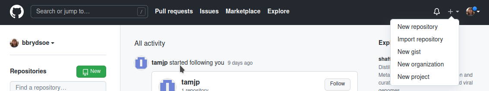

## Merge conflicts 

In this exercise everyone in the team will be working in the same branch, for instance the master branch. 

Merge conflicts generally happen when two (or more) teammembers edit the same file and the same line, or when one edits a file and another deletes it. 

1. Create a new repository on GitHub. Add your team members as in the previous exercises. Everyone clones the repository. 

**Solution**

One of you should go to your GitHub page and create a new repository (or use the main branch of one of the repositories you just created for the previous exercise, as long as you use the same). 

 

Add your team members if you created a new repository, otherwise your team members should already be added since the previous exercises. 

If you are using an already existing repository, remember to check with 'git branch' that you are on the main branch. Switch to the main branch with 'git checkout main' if you are on a different branch. 

I am going to use the main branch of the same repository I used for the earlier exercises - 'mytestrepo'. 

2. Create a couple files. Add, commit, and push. 
   - If more than one creates files, remember to either pull your teammates work first, or do a `git pull --rebase` before pushing. 

**Solution** 

```shell
bbrydsoe@enterprise-a:~/mytestrepo$ touch file1.txt
bbrydsoe@enterprise-a:~/mytestrepo$ touch file2.txt
bbrydsoe@enterprise-a:~/mytestrepo$ touch file3.txt
bbrydsoe@enterprise-a:~/mytestrepo$ git add file*
bbrydsoe@enterprise-a:~/mytestrepo$ git commit -m "Adding some files to play with for the exercise."
[main c8e5214] Adding some files to play with for the exercise.
 3 files changed, 0 insertions(+), 0 deletions(-)
 create mode 100644 file1.txt
 create mode 100644 file2.txt
 create mode 100644 file3.txt
bbrydsoe@enterprise-a:~/mytestrepo$ git push
Enter passphrase for key '/home/bbrydsoe/.ssh/id_rsa': 
Enumerating objects: 3, done.
Counting objects: 100% (3/3), done.
Delta compression using up to 4 threads
Compressing objects: 100% (2/2), done.
Writing objects: 100% (2/2), 292 bytes | 292.00 KiB/s, done.
Total 2 (delta 1), reused 0 (delta 0)
remote: Resolving deltas: 100% (1/1), completed with 1 local object.
To github.com:bbrydsoe/mytestrepo.git
   333d5e5..c8e5214  main -> main
```

As an example, I will see what happens if I create another file and tries to push it, only to find that someone else has added a file to the repository that I have not pulled: 

```shell
bbrydsoe@enterprise-a:~/mytestrepo$ touch file4.txt
bbrydsoe@enterprise-a:~/mytestrepo$ git add file4.txt 
bbrydsoe@enterprise-a:~/mytestrepo$ git commit -m "Adding the file file4.txt"
[main 21bc4bc] Adding the file file4.txt
 1 file changed, 0 insertions(+), 0 deletions(-)
 create mode 100644 file4.txt
bbrydsoe@enterprise-a:~/mytestrepo$ git push
Enter passphrase for key '/home/bbrydsoe/.ssh/id_rsa': 
To github.com:bbrydsoe/mytestrepo.git
 ! [rejected]        main -> main (fetch first)
error: failed to push some refs to 'git@github.com:bbrydsoe/mytestrepo.git'
hint: Updates were rejected because the remote contains work that you do
hint: not have locally. This is usually caused by another repository pushing
hint: to the same ref. You may want to first integrate the remote changes
hint: (e.g., 'git pull ...') before pushing again.
hint: See the 'Note about fast-forwards' in 'git push --help' for details.
```

Git complains! 

How to fix? In this case it is easy. I will do a 'git pull --rebase' and then do the push: 

```shell
bbrydsoe@enterprise-a:~/mytestrepo$ git pull --rebase
Enter passphrase for key '/home/bbrydsoe/.ssh/id_rsa': 
remote: Enumerating objects: 4, done.
remote: Counting objects: 100% (4/4), done.
remote: Compressing objects: 100% (2/2), done.
remote: Total 3 (delta 1), reused 0 (delta 0), pack-reused 0
Unpacking objects: 100% (3/3), 687 bytes | 687.00 KiB/s, done.
From github.com:bbrydsoe/mytestrepo
   c8e5214..805d9b3  main       -> origin/main
First, rewinding head to replay your work on top of it...
Applying: Adding the file file4.txt
bbrydsoe@enterprise-a:~/mytestrepo$ git push
Enter passphrase for key '/home/bbrydsoe/.ssh/id_rsa': 
Enumerating objects: 3, done.
Counting objects: 100% (3/3), done.
Delta compression using up to 4 threads
Compressing objects: 100% (2/2), done.
Writing objects: 100% (2/2), 255 bytes | 255.00 KiB/s, done.
Total 2 (delta 1), reused 0 (delta 0)
remote: Resolving deltas: 100% (1/1), completed with 1 local object.
To github.com:bbrydsoe/mytestrepo.git
   805d9b3..c74b74c  main -> main
```

4. After doing this, everyone should again do a `git pull`

**Solution**

Just do a 'git pull' to get the stuff your team members have created (or so the other members of the group get the files that one of you created): 

```shell
bbrydsoe@enterprise-a:~/mytestrepo$ git pull
Enter passphrase for key '/home/bbrydsoe/.ssh/id_rsa': 
remote: Enumerating objects: 7, done.
remote: Counting objects: 100% (7/7), done.
remote: Compressing objects: 100% (4/4), done.
remote: Total 6 (delta 2), reused 0 (delta 0), pack-reused 0
Unpacking objects: 100% (6/6), 1.27 KiB | 648.00 KiB/s, done.
From github.com:bbrydsoe/mytestrepo
   c74b74c..af9e1cb  main       -> origin/main
Updating c74b74c..af9e1cb
Fast-forward
 Weird.txt | 1 +
 funny.txt | 1 +
 2 files changed, 2 insertions(+)
 create mode 100644 Weird.txt
 create mode 100644 funny.txt
```

5. Now one or more make changes to the same file, in the same line. Add, commit, push. 

**Solution**

In this example, two are changing the file 'funny.txt' in the same line. I try to push my changes and find that the other pushed their change first: 

```shell
bbrydsoe@enterprise-a:~/mytestrepo$ vi funny.txt 
bbrydsoe@enterprise-a:~/mytestrepo$ git add funny.txt 
bbrydsoe@enterprise-a:~/mytestrepo$ git commit -m "Updating the file funny.txt"
[main f835b0c] Updating the file funny.txt
 1 file changed, 1 insertion(+), 1 deletion(-)
bbrydsoe@enterprise-a:~/mytestrepo$ git push
Enter passphrase for key '/home/bbrydsoe/.ssh/id_rsa': 
To github.com:bbrydsoe/mytestrepo.git
 ! [rejected]        main -> main (fetch first)
error: failed to push some refs to 'git@github.com:bbrydsoe/mytestrepo.git'
hint: Updates were rejected because the remote contains work that you do
hint: not have locally. This is usually caused by another repository pushing
hint: to the same ref. You may want to first integrate the remote changes
hint: (e.g., 'git pull ...') before pushing again.
hint: See the 'Note about fast-forwards' in 'git push --help' for details.
```

6. Did you get a conflict? Use `git status`, `git branch`, and `git log` to see what has happened. Try to resolve the conflict. 

**Solution**

```shell
On branch main
Your branch is ahead of 'origin/main' by 1 commit.
  (use "git push" to publish your local commits)

nothing to commit, working tree clean
```

```shell
bbrydsoe@enterprise-a:~/mytestrepo$ git log --oneline --abbrev-commit --all --graph
* f835b0c (HEAD -> main) Updating the file funny.txt
* af9e1cb (origin/main, origin/HEAD) Create Weird.txt
* db2e945 Create funny.txt
* c74b74c Adding the file file4.txt
* 805d9b3 Create newfile.txt
* c8e5214 Adding some files to play with for the exercise.
* d4a666e Adding my new file to the repository.
* 303bf63 Create README.md
```

Not much information, except the hint you got to try and pull. Let us try and doa 'git pull --rebase':

```shell
bbrydsoe@enterprise-a:~/mytestrepo$ git pull --rebase
Enter passphrase for key '/home/bbrydsoe/.ssh/id_rsa': 
remote: Enumerating objects: 5, done.
remote: Counting objects: 100% (5/5), done.
remote: Compressing objects: 100% (2/2), done.
remote: Total 3 (delta 1), reused 0 (delta 0), pack-reused 0
Unpacking objects: 100% (3/3), 675 bytes | 675.00 KiB/s, done.
From github.com:bbrydsoe/mytestrepo
   af9e1cb..43110f8  main       -> origin/main
First, rewinding head to replay your work on top of it...
Applying: Updating the file funny.txt
Using index info to reconstruct a base tree...
M	funny.txt
Falling back to patching base and 3-way merge...
Auto-merging funny.txt
CONFLICT (content): Merge conflict in funny.txt
error: Failed to merge in the changes.
Patch failed at 0001 Updating the file funny.txt
hint: Use 'git am --show-current-patch' to see the failed patch
Resolve all conflicts manually, mark them as resolved with
"git add/rm <conflicted_files>", then run "git rebase --continue".
You can instead skip this commit: run "git rebase --skip".
To abort and get back to the state before "git rebase", run "git rebase --abort".
```

Unfortunately, this is not a conflict that can be resolved automatically. We have to fix this manually, as we saw in the earlier exercises. 

Open the offending file with your favourite editor and change the contents as you think it should be. Remember to remove the dividers (=======) and the angle brackets. 

When you are happy with the file, stage and push the file: 

```shell 
bbrydsoe@enterprise-a:~/mytestrepo$ git add funny.txt 
bbrydsoe@enterprise-a:~/mytestrepo$ git rebase --continue
Applying: Updating the file funny.txt
```

NOTE: this should be done by the owner of the repository. Then do a fresh pull. 


7. Now again all will work on one file. One or more edit it and one deletes it (`git rm file`). What happens when you push your work? You should get a conflict. Try and resolve the conflict. Should the file be kept or deleted? 

**Solution**

Again, the complaint from git is similar to above and this should be resolved by the owner of the repository. 

