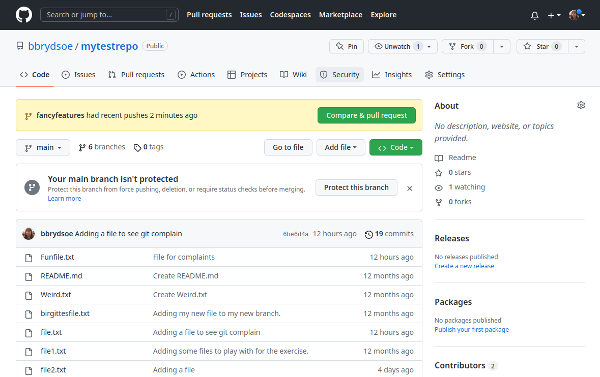
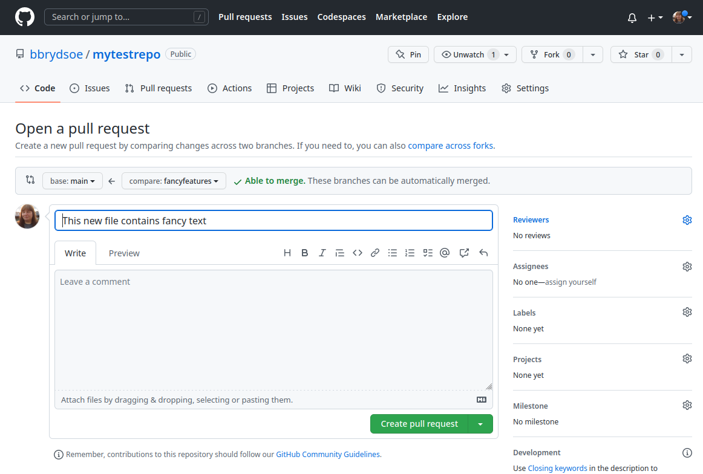
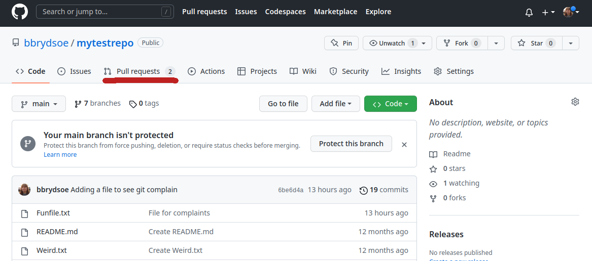
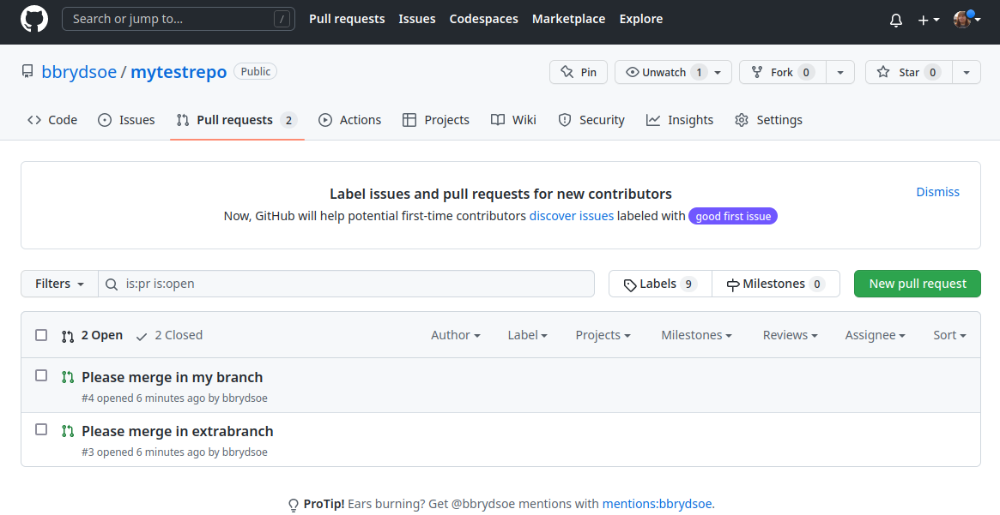
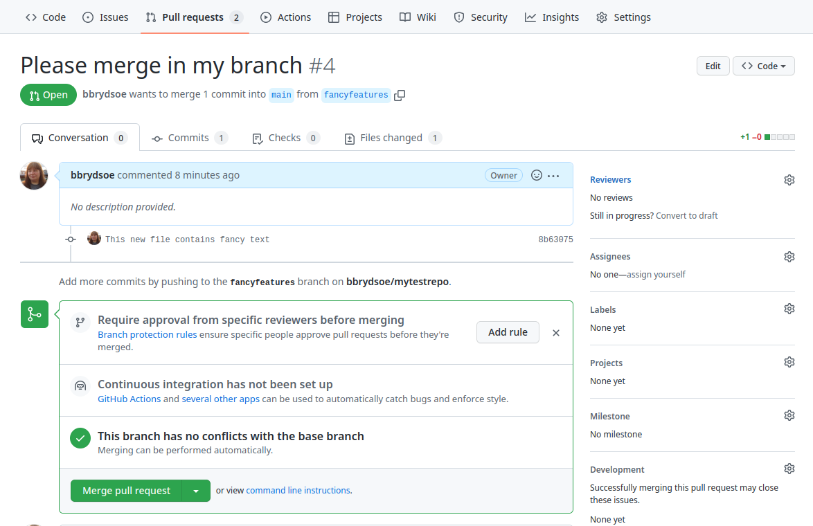
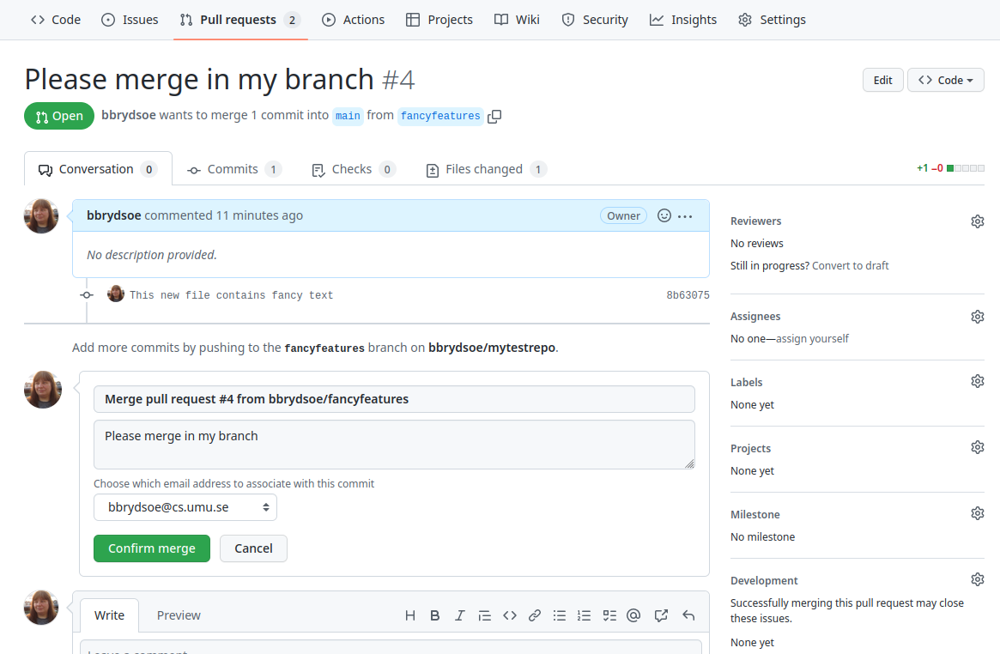
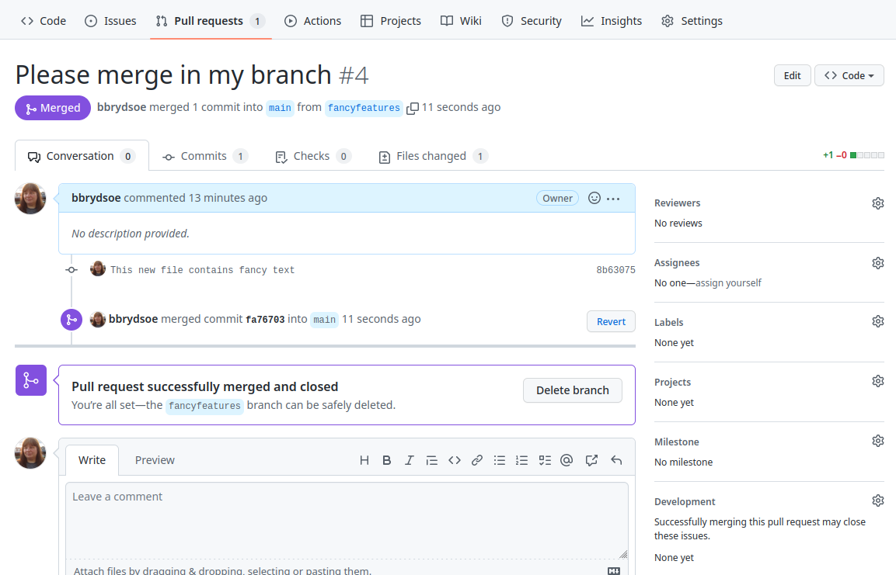

# 6. Teamwork, branches and merging, pull requests 

1. Go to the repository on the GitHub page. Submit a pull-request from your branch to the main branch

	In my solutions I am going to use the branch "fancyfeatures" that I created in my repository in the previous exercise "5.teamwork-branches-merging"

	This is how it looks on GitHub, after I pushed the changes for my new branch:

	 


	Note that the comment about "Your main branch isn't protected" will not be there if you are not the owner of the repository. It is possible to make a main/master branch protected so your collaborators cannot make changes directly. 

	To make a pull request, push the green button marked "Compare & pull request". Then it will look like this: 

	

	Write some description of what is done in your branch and why it should be merged to the main/master branch. 

	Then click "Create pull request"

2. The owner of the repository (the person who created it) can then accept them and click to merge them.

	This is how it looks for the owner of the repository if there are pull requests: 

	

(Red line added by me) 

	The owner of the repository should click on the "Pull requests". It will then look similar to this: 



	Click on them one at a time to see what the reason is for the pull request and what your collaborator has said is in the branch. 



	Here you can see that there are no conflicts. When you have checked what the branch is about and decided you are happy to merge, click "Merge pull request".



	Write optionally something about your decision and then click "Confirm merge"



3. After doing so, everyone should again do a `git pull` (on the command line)

	My example:

	```shell
	bbrydsoe@enterprise-a:~/mytestrepo$ git pull
	Enter passphrase for key '/home/bbrydsoe/.ssh/id_rsa': 
	remote: Enumerating objects: 1, done.
	remote: Counting objects: 100% (1/1), done.
	remote: Total 1 (delta 0), reused 0 (delta 0), pack-reused 0
	Unpacking objects: 100% (1/1), 637 bytes | 637.00 KiB/s, done.
	From github.com:bbrydsoe/mytestrepo
	   6be6d4a..fa76703  main       -> origin/main
	Already up-to-date.
	```

4. Use `git status`, `git branch --all`, and `git log --graph --oneline --decorate --all` to see what has happened.

	```shell
	bbrydsoe@enterprise-a:~/mytestrepo$ git status
	On branch fancyfeatures
	Your branch is up-to-date with 'origin/fancyfeatures'.

	nothing to commit, working tree clean
	bbrydsoe@enterprise-a:~/mytestrepo$ 
	```

	As you see, you are still on your branch (that has now been merged)

	```shell
	bbrydsoe@enterprise-a:~/mytestrepo$ git branch --all
	  birgittesbranch
	  * fancyfeatures
	  main
	  mynewbranch
	  mytestbranch
	  remotes/origin/HEAD -> origin/main
	  remotes/origin/birgittesbranch
	  remotes/origin/extrabranch
	  remotes/origin/fancyfeatures
	  remotes/origin/main
	  remotes/origin/mynewbranch
	  remotes/origin/mytestbranch
	  remotes/origin/spocksbranch
	```

	As you can see, your branch and all the other branches still exist. The ones that are not your own are only on the remote. The branch you are on is marked with a * 

	Let us look at the (top of the) log

	```shell
	bbrydsoe@enterprise-a:~/mytestrepo$ git log --graph --oneline --decorate --all
	*   fa76703 (origin/main, origin/HEAD) Merge pull request #4 from bbrydsoe/fancyfeatures
	|\  
	| * 8b63075 (HEAD -> fancyfeatures, origin/fancyfeatures) This new file contains fancy text
	|/  
	| * eaf70c0 (origin/extrabranch) Adding a file to my new branch extrabranch
	|/  
	* 6be6d4a (main) Adding a file to see git complain
	...
	```

