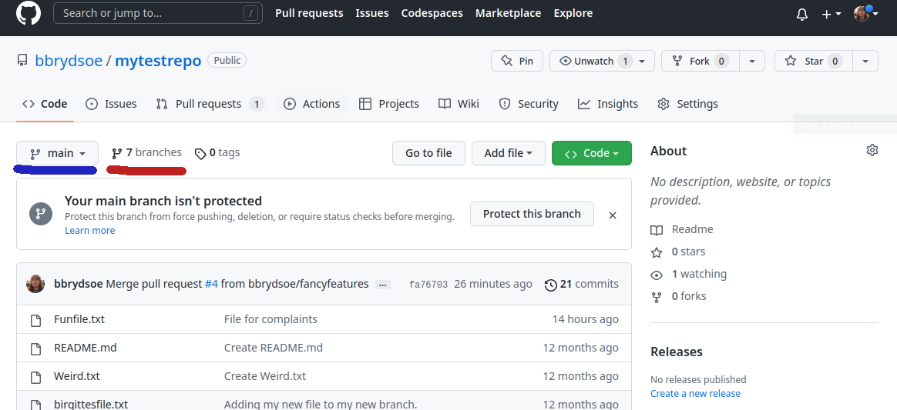
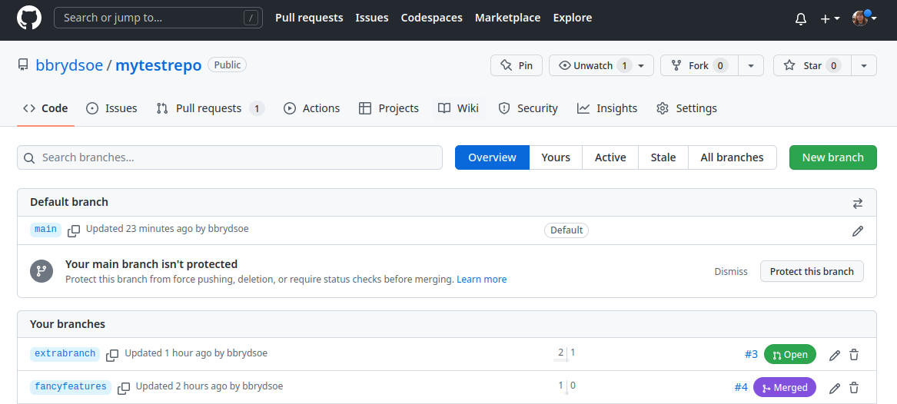
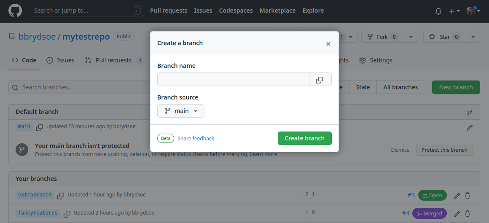
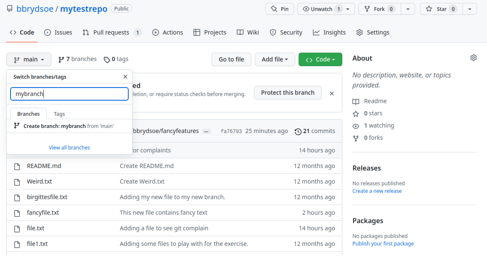

# 7. Teamwork and branches  

Now you will be creating a new branch in the repo your group is sharing, but you will create in from the GitHub page. 

1. Everyone in the group create a new branch in the repo - this time you could try doing it from the GitHub page. 

	You can do it two ways; either by pressing the "branches" (marked by me with a red line) and then picking the green "New branch" button on the right side, or by pressing "main" (marked by me with a blue line) and writing your new branch's name in the field and then clicking "Create branch: <branch-name> from main"



	Option 1: Creating from clicking "branches": 

 

	
	Note that you could create a branch from one of the other branches instead of main, if you want to. 

	Option 2: Creating from clicking "main": 



2. Check which remote branches exist with `git branch -r`

	This is done on the command line. Note that you need to do a pull before you will see the newly created branches: 
	
	Before a pull:

	```shell
	bbrydsoe@enterprise-a:~/mytestrepo$ git branch -r
	  origin/HEAD -> origin/main
	  origin/birgittesbranch
	  origin/extrabranch
	  origin/fancyfeatures
	  origin/main
	  origin/mynewbranch
	  origin/mytestbranch
	  origin/spocksbranch
	```

	After a pull: 

	```shell
	bbrydsoe@enterprise-a:~/mytestrepo$ git pull
	Enter passphrase for key '/home/bbrydsoe/.ssh/id_rsa': 
	From github.com:bbrydsoe/mytestrepo
	 * [new branch]      mybranch         -> origin/mybranch
	 * [new branch]      yetanotherbranch -> origin/yetanotherbranch
	Already up-to-date.
	```

	```shell
	bbrydsoe@enterprise-a:~/mytestrepo$ git branch -r
	  origin/HEAD -> origin/main
	  origin/birgittesbranch
	  origin/extrabranch
	  origin/fancyfeatures
	  origin/main
	  origin/mybranch
	  origin/mynewbranch
	  origin/mytestbranch
	  origin/spocksbranch
	  origin/yetanotherbranch
	```

3. Check which local branches you have with `git branch`

	```shell
	bbrydsoe@enterprise-a:~/mytestrepo$ git branch
	  birgittesbranch
	* fancyfeatures
	  main
	  mynewbranch
	  mytestbranch
	```

	So no changes here, as the branches were created remotely.  

4. Use `git status` to see which branch you are on. 


5. Check with `git branch -a` to see all local and remote branches

6. Do a `git pull` from the command line to get a list of all branches. Switch to the branch you created on GitHub with `git checkout --track origin/mynewbranch`. Again do `git branch` to see which branch you are on.

7. Create a new file and put some content to it. Add and commit it. Check for changes (`git status`, `git log`). Push the changes.

8. Try and merge the branches from the command line. Remember to first pull any changes from your other group members. Also remember to switch to the branch you want to merge it to (main in this case).

9. Were you succesful? Why or why not? Is there are difference between what happens when the owner of the branch tries this and when everyone else does?

10. After doing this, everyone should again do a `git pull` (on the command line)

11. Use `git status`, `git branch`, and `git log` to see what has happened. If you want a "prettier" and sometimes easier to read view, use `git log --graph --oneline --decorate --all`

